layout: true

<div class="my-footer">
  <span style="text-align:center">
    <span> 
      
    </span>
    <a href="https://therbootcamp.github.io/">
      <span style="padding-left:82px"> 
        <font color="#7E7E7E">
          www.therbootcamp.com
        </font>
      </span>
    </a>
    <a href="https://therbootcamp.github.io/">
      <font color="#7E7E7E">
      Machine Learning with R @ DHLab  | September 2022
      </font>
    </a>
    </span>
  </div> 

---


```{r setup, include=FALSE}
options(htmltools.dir.version = FALSE)
# see: https://github.com/yihui/xaringan
# install.packages("xaringan")
# see: 
# https://github.com/yihui/xaringan/wiki
# https://github.com/gnab/remark/wiki/Markdown
options(width=110)
options(digits = 4)

# Get color palette functions

source("https://raw.githubusercontent.com/therbootcamp/ML_2019Oct/master/_materials/code/baselrbootcamp_palettes.R")
```


```{r, echo = FALSE ,message = FALSE, warning = FALSE}
library(tidyverse)
library(keras)


```

.pull-left3[

# Neural processing in the brain

<ul>
  <li class="m1"><span>Efforts are made to build neural network models that <high>mimick the brain's architectural properties</high> concerning, e.g., the visual system.</span></li>
</ul>

]


.pull-right6[

<br><br>

<p align = "center">
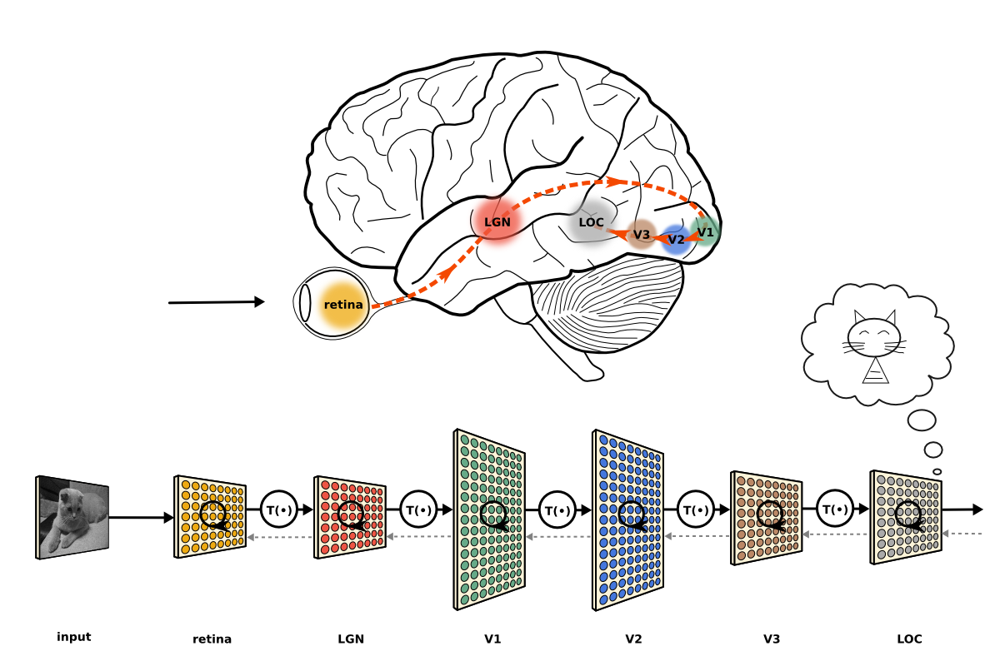<br>
<font style="font-size:10px">from <a href="https://neuwritesd.org/2015/10/22/deep-neural-networks-help-us-read-your-mind/">neuwritesd.org</a>, see <a href="https://www.pnas.org/content/111/23/8619">this</a></font>
</p>

]


---

.pull-left3[

# Semantic space

<ul>
  <li class="m1"><span>Many cognitive models build on some for of a <high>mnemonic representation of words</high> and their meaning, which can be apprximated using network-based vector space models.</span></li>
  <li class="m2"><span><high>Tasks</high> linked to vector space models:</span></li>
  <ul>
      <li><span>Verbal fluency</span></li>
      <li><span>Similarity ratings</span></li>
      <li><span>Paired associated learning</span></li>
      <li><span>Free recall</span></li>
      <li><span>Verbal reasoning</span></li>
      <li><span>etc.</span></li>
  </ul>
</ul>

]


.pull-right6[

<p align = "center">
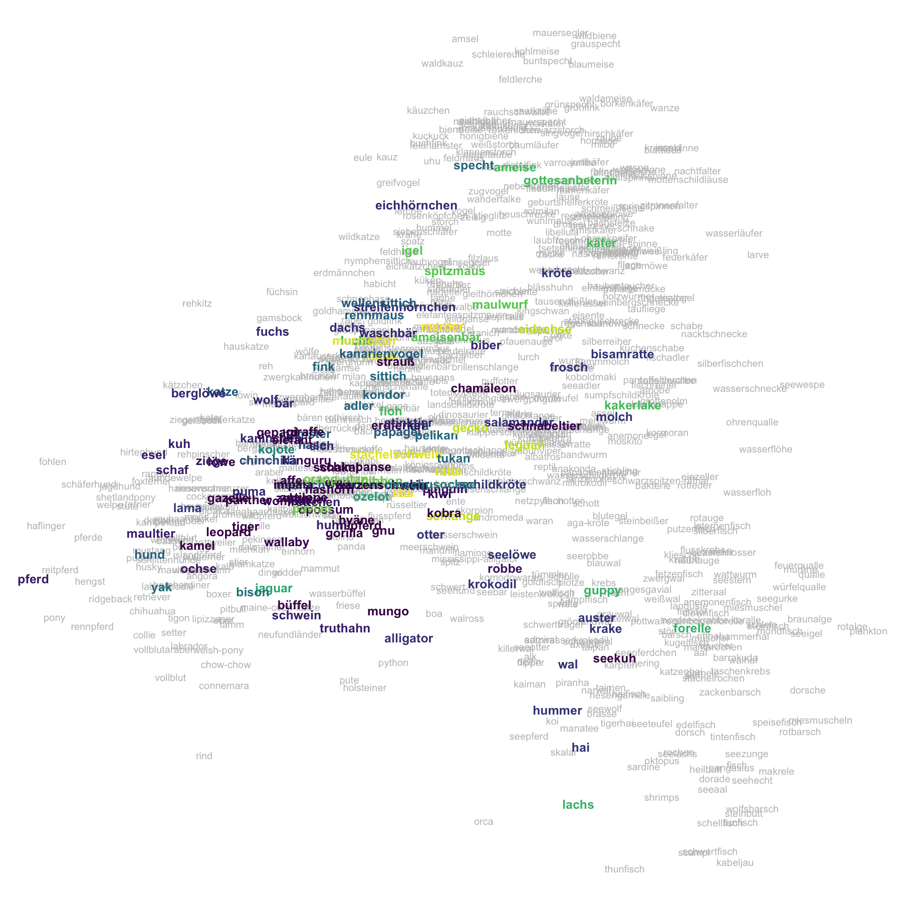
</p>

]

---

.pull-left3[

# Walks in semantic space

<ul>
  <li class="m1"><span>A popular idea is that retrieval from (semantic) memory acts like a <high>random walk through the word vector space</high>.</span></li>
  <li class="m2"><span><high>Verbal fluency</high> sequences are consistent with this notion barring the occasional jump.</span></li>
</ul>

]


.pull-right6[

<p align = "center">
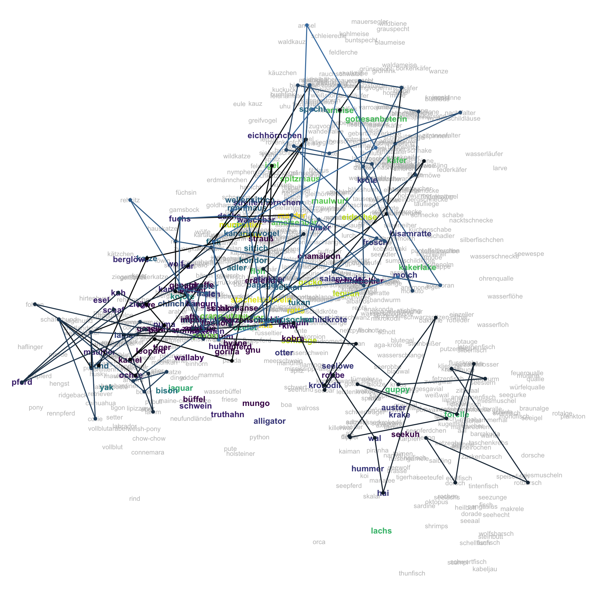
</p>

]

---

.pull-left3[


# Walks in semantic space

<ul>
  <li class="m1"><span>A popular idea is that retrieval from (semantic) memory acts like a <high>random walk through the word vector space</high>.</span></li>
  <li class="m2"><span><high>Verbal fluency</high> sequences are consistent with this notion barring the occasional jump.</span></li>
</ul>

]


.pull-right6[

<p align = "center">
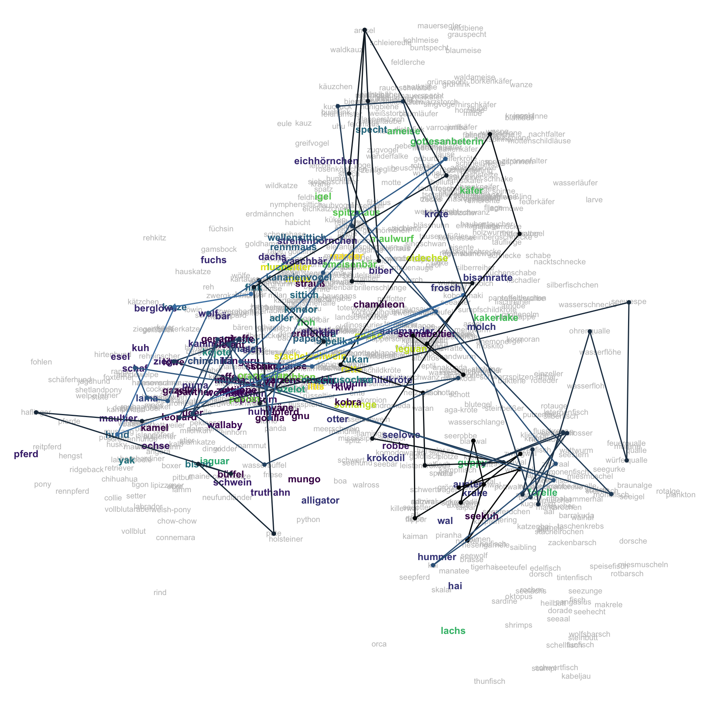
</p>

]


---

.pull-left3[

# Walks in semantic space

<ul>
  <li class="m1"><span>A popular idea is that retrieval from (semantic) memory acts like a <high>random walk through the word vector space</high>.</span></li>
  <li class="m2"><span><high>Verbal fluency</high> sequences are consistent with this notion barring the occasional jump.</span></li>
</ul>

]


.pull-right6[

<p align = "center">
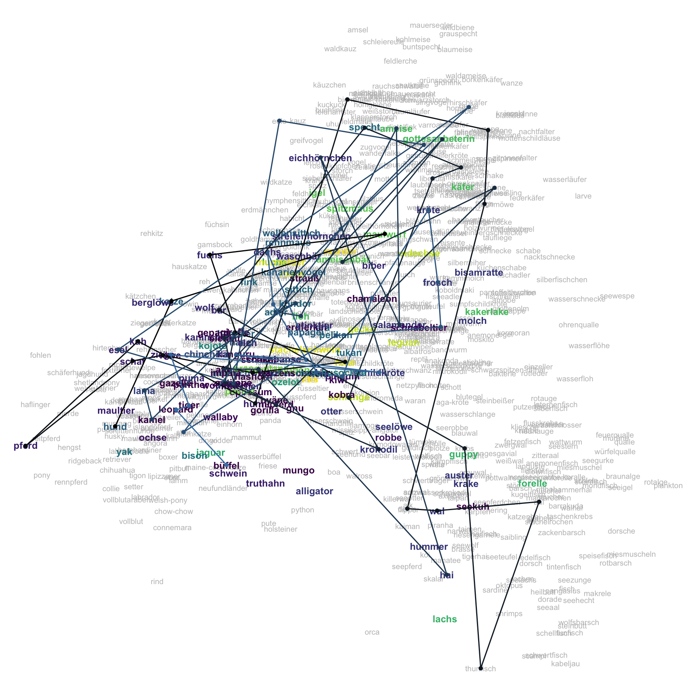
</p>

]

---

.pull-left3[

# Walks in semantic space

<ul>
  <li class="m1"><span>A popular idea is that retrieval from (semantic) memory acts like a <high>random walk through the word vector space</high>.</span></li>
  <li class="m2"><span><high>Verbal fluency</high> sequences are consistent with this notion barring the occasional jump.</span></li>
</ul>

]


.pull-right6[

<p align = "center">

</p>

]

---

.pull-left3[

# Hopfield

<ul>
  <li class="m1"><span>Hopfield networks are a form of recurrent neural network, that can be used as <high>models of recognition</high>.</span></li>
  <li class="m2"><span>They can be using Hebbian learning: <high>fire together, wire together</high>.</span></li>
</ul>

$$\Large \Delta w_{ij}=\eta \cdot a_{i}\cdot a_{j}$$

]


.pull-right6[

<br><br>

<p align = "center">
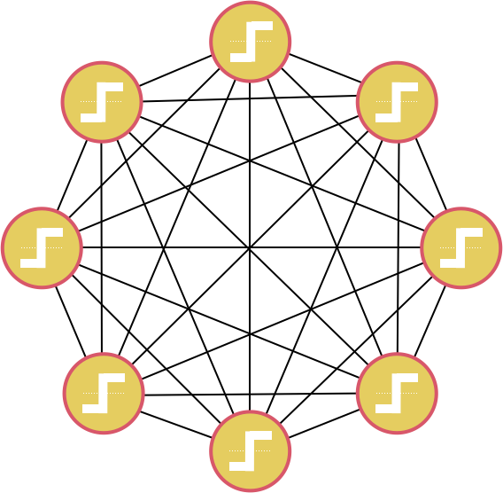
</p>

]


---

.pull-left3[

# Hopfield

<ul>
  <li class="m1"><span>Hopfield networks are a form of recurrent neural network, that can be used as <high>models of recognition</high>.</span></li>
  <li class="m2"><span>They can be using Hebbian learning: <high>fire together, wire together</high>.</span></li>
</ul>

$$\Large \Delta w_{ij}=\eta \cdot a_{i}\cdot a_{j}$$

]


.pull-right6[

<br><br>

<p align = "center">
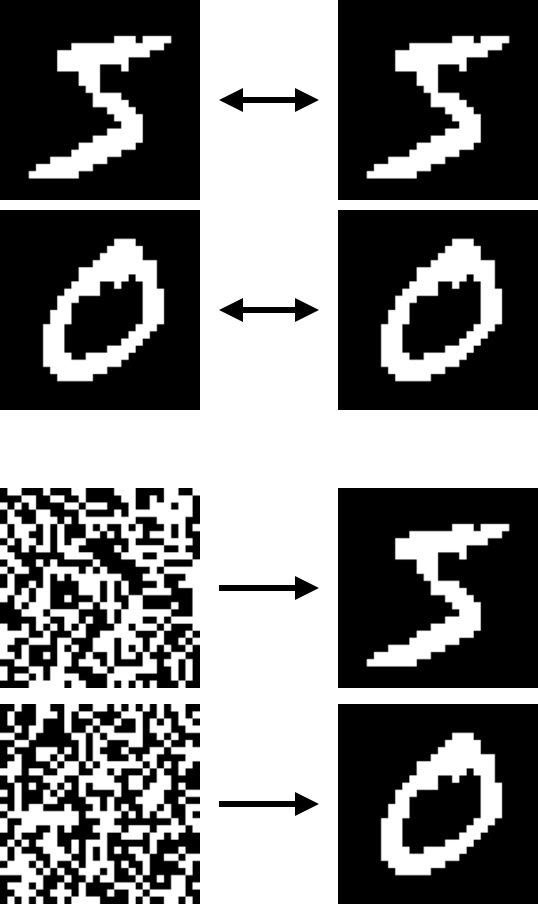
</p>

]

---

.pull-left3[

# Hopfield

<ul>
  <li class="m1"><span>Hopfield networks are a form of recurrent neural network, that can be used as <high>models of recognition</high>.</span></li>
  <li class="m2"><span>They can be using Hebbian learning: <high>fire together, wire together</high>.</span></li>
</ul>

$$\Large \Delta w_{ij}=\eta \cdot a_{i}\cdot a_{j}$$

]


.pull-right6[

<br><br>

<p align = "center">
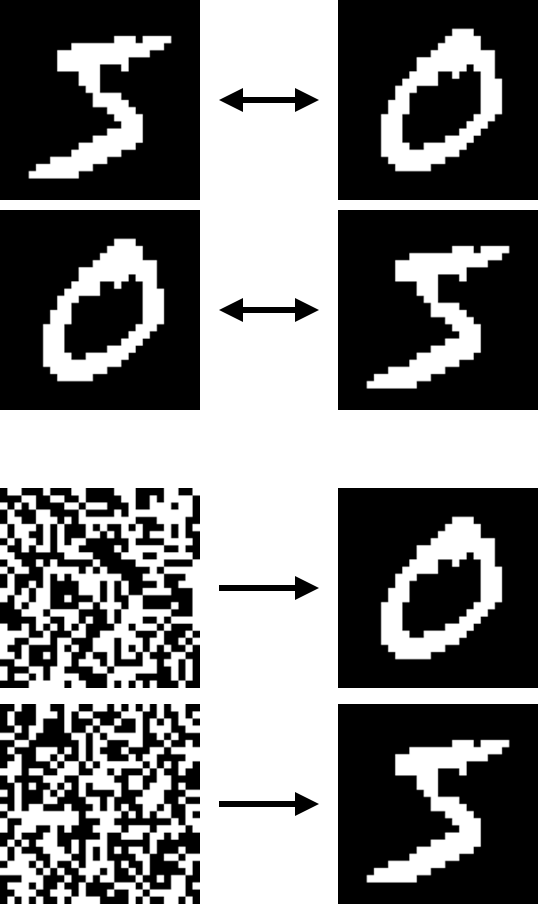
</p>

]

---

.pull-left3[

# Hopfield

<ul>
  <li class="m1"><span>Hopfield networks are a form of recurrent neural network, that can be used as <high>models of recognition and associative memory</high> .</span></li>
  <li class="m2"><span>They can be using Hebbian learning: <high>fire together, wire together</high>.</span></li>
</ul>

$$\Large \Delta w_{ij}=\eta \cdot a_{i}\cdot a_{j}$$

]


.pull-right6[

<br><br>

<p align = "center">
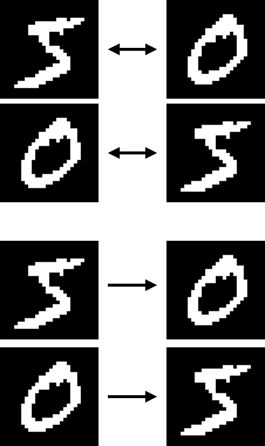
</p>

]


---

.pull-left3[

# Cognitive consistency

<ul>
  <li class="m1"><span>Recursive networks can be used to predict the dynamics and outcomes of <high>consistency-driven cognitive reasoning</high>.</span></li>
  <li class="m2"><span>Domains:</span></li>
  <ul>
    <li><span>Dissonance theory</span></li>  
    <li><span>Opinion formation</span></li> 
    <li><span>Inference</span></li>
    <li><span>Decision making</span></li> 
  </ul>
</ul>

]


.pull-right6[

<br><br>

<p align = "center">
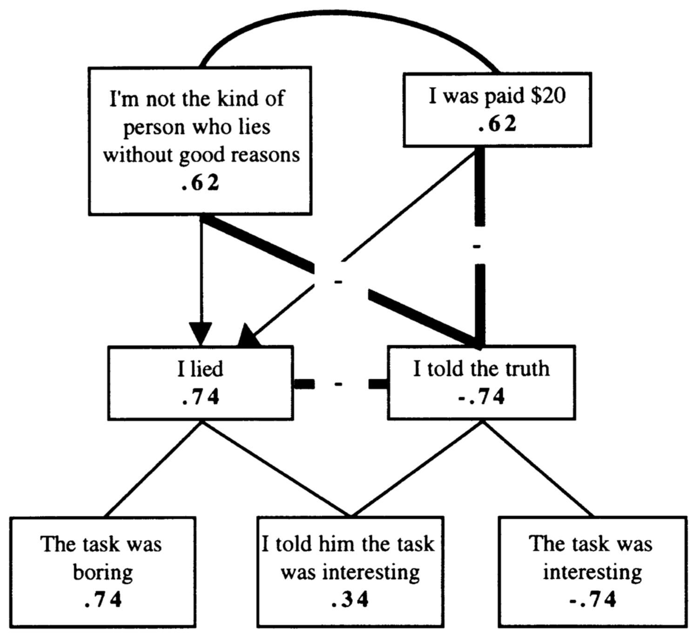<br>
<font style="font-size:10px">from <a href="https://journals.sagepub.com/doi/10.1207/s15327957pspr0101_3">Read, Vanman, & Miller (1997)</a>
</p>

]

---

.pull-left3[

# Cognitive consistency

<ul>
  <li class="m1"><span>Recursive networks can be used to predict the dynamics and outcomes of <high>consistency-driven cognitive reasoning</high>.</span></li>
  <li class="m2"><span>Domains:</span></li>
  <ul>
    <li><span>Dissonance theory</span></li>  
    <li><span>Opinion formation</span></li> 
    <li><span>Inference</span></li>
    <li><span>Decision making</span></li> 
  </ul>
</ul>

]


.pull-right6[

<br><br>

<p align = "center">
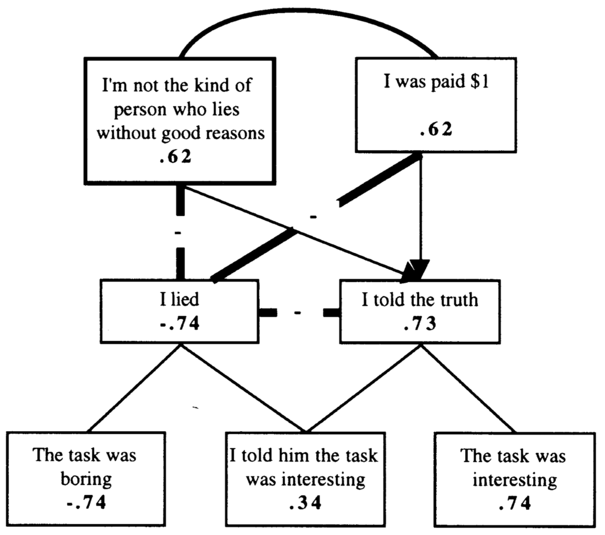<br>
<font style="font-size:10px">from <a href="https://journals.sagepub.com/doi/10.1207/s15327957pspr0101_3">Read, Vanman, & Miller (1997)</a>
</p>

]

---

.pull-left3[

# Cognitive consistency

<ul>
  <li class="m1"><span>Recursive networks can be used to predict the dynamics and outcomes of <high>consistency-driven cognitive reasoning</high>.</span></li>
  <li class="m2"><span>Domains:</span></li>
  <ul>
    <li><span>Dissonance theory</span></li>  
    <li><span>Opinion formation</span></li> 
    <li><span>Inference</span></li>
    <li><span>Decision making</span></li> 
  </ul>
</ul>

]


.pull-right6[

<br><br>

<p align = "center">
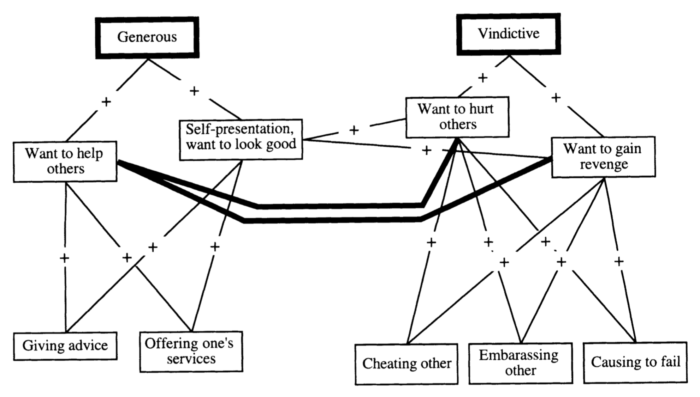<br>
<font style="font-size:10px">from <a href="https://journals.sagepub.com/doi/10.1207/s15327957pspr0101_3">Read, Vanman, & Miller (1997)</a>
</p>

]

---

.pull-left3[

# Cognitive consistency

<ul>
  <li class="m1"><span>Recursive networks can be used to predict the dynamics and outcomes of <high>consistency-driven cognitive reasoning</high>.</span></li>
  <li class="m2"><span>Domains:</span></li>
  <ul>
    <li><span>Dissonance theory</span></li>  
    <li><span>Opinion formation</span></li> 
    <li><span>Inference</span></li>
    <li><span>Decision making</span></li> 
  </ul>
</ul>

]


.pull-right6[

<br><br>

<p align = "center">
<br>
<font style="font-size:10px">from <a href="https://journals.sagepub.com/doi/10.1207/s15327957pspr0101_3">Read, Vanman, & Miller (1997)</a>
</p>

]

---

.pull-left3[

# Cognitive consistency

<ul>
  <li class="m1"><span>Recursive networks can be used to predict the dynamics and outcomes of <high>consistency-driven cognitive reasoning</high>.</span></li>
  <li class="m2"><span>Domains:</span></li>
  <ul>
    <li><span>Dissonance theory</span></li>  
    <li><span>Opinion formation</span></li> 
    <li><span>Inference</span></li>
    <li><span>Decision making</span></li> 
  </ul>
</ul>

]


.pull-right6[

<br><br>

<p align = "center">
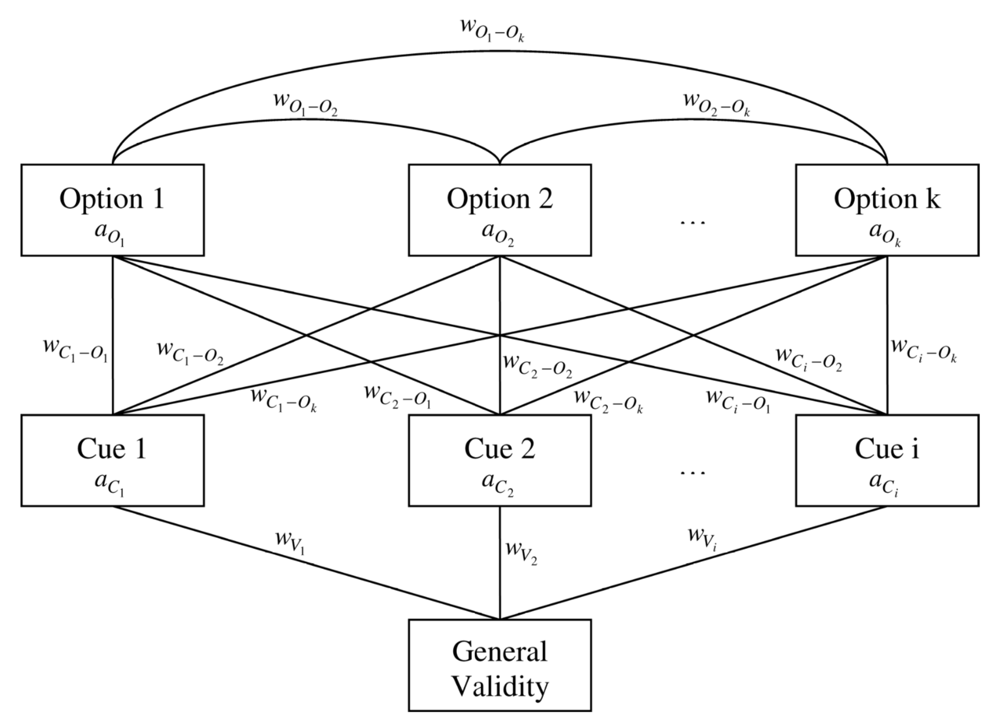<br>
<font style="font-size:10px">from <a href="https://www.econstor.eu/bitstream/10419/26939/1/572287593.PDF">Glöckner & Betsch (2008)</a>
</p>

]

---

.pull-left3[

# Cognitive consistency

<ul>
  <li class="m1"><span>Recursive networks can be used to predict the dynamics and outcomes of <high>consistency-driven cognitive reasoning</high>.</span></li>
  <li class="m2"><span>Domains:</span></li>
  <ul>
    <li><span>Dissonance theory</span></li>  
    <li><span>Opinion formation</span></li> 
    <li><span>Inference</span></li>
    <li><span>Decision making</span></li> 
  </ul>
</ul>

]


.pull-right6[

<br><br>

<p align = "center">
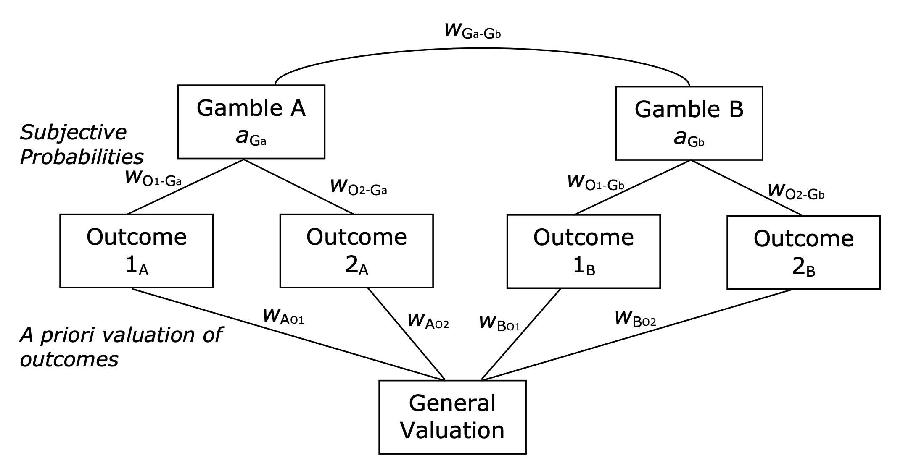<br>
<font style="font-size:10px">from <a href="https://www.econstor.eu/bitstream/10419/32204/1/605761744.pdf">Glöckner & Herbold(2008)</a>
</p>

]


---

class: middle, center

<h1><a href="https://cdsbasel.github.io/neuralnetworks/menu/schedule & materials.html">Materials</a></h1>


