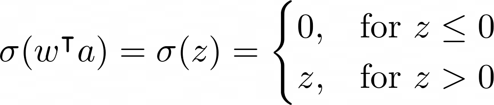
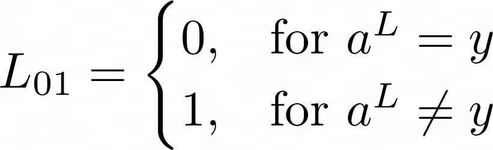
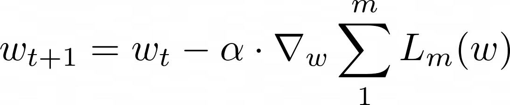
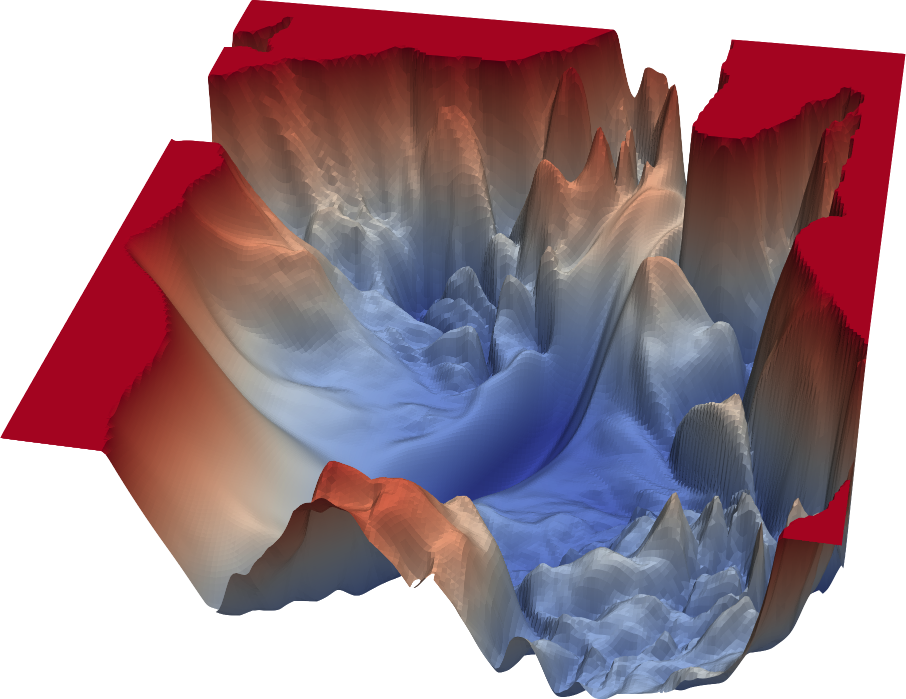

layout: true

<div class="my-footer">
  <span style="text-align:center">
    <span> 
      
    </span>
    <a href="https://therbootcamp.github.io/">
      <span style="padding-left:82px"> 
        <font color="#7E7E7E">
          www.therbootcamp.com
        </font>
      </span>
    </a>
    <a href="https://therbootcamp.github.io/">
      <font color="#7E7E7E">
      Machine Learning with R @ ARC  | May 2023
      </font>
    </a>
    </span>
  </div> 

---


```{r setup, include=FALSE}
options(htmltools.dir.version = FALSE)
# see: https://github.com/yihui/xaringan
# install.packages("xaringan")
# see: 
# https://github.com/yihui/xaringan/wiki
# https://github.com/gnab/remark/wiki/Markdown
options(width=110)
options(digits = 4)

# Get color palette functions

source("https://raw.githubusercontent.com/therbootcamp/ML_2019Oct/master/_materials/code/baselrbootcamp_palettes.R")
```


```{r, echo = FALSE ,message = FALSE, warning = FALSE}

library(tidyverse)
library(keras)
reticulate::use_condaenv("tf")

digit = readRDS('1_Data/digit.RDS')
#digit = readRDS('_sessions/DeepFeedForward/1_Data/digit.RDS')
n = 100
digit[[1]][[1]] = digit[[1]][[1]][1:n,,]
digit[[1]][[2]] = digit[[1]][[2]][1:n]
digit[[2]][[1]] = digit[[2]][[1]][1:n,,]
digit[[2]][[2]] = digit[[2]][[2]][1:n]

plt_imgs = function(imgs, labs, true_labs = NULL){
  rows = ceiling(sqrt(nrow(imgs)))
  cols = ceiling(nrow(imgs) / rows)
  
  par(mfcol=c(rows, cols))
  par(mar=c(0, 0, 1.6, 0), xaxs='i', yaxs='i')
  for (i in 1:nrow(imgs)) { 
    img <- imgs[i, , ]
    img <- t(apply(img, 2, rev)) 
    image(1:28, 1:28, img, col = gray((0:255)/255), xaxt = 'n', yaxt = 'n')
    if(is.null(true_labs)) {
      mtext(paste(labs[i]),cex=1,line=.2)
      } else {
      col = ifelse(labs[i] == true_labs[i], 'black', 'red')
      lab =  ifelse(labs[i] == true_labs[i], labs[i], paste(labs[i],'(',true_labs[i],')'))
      mtext(lab, col = col,cex=1,line=.2)
      }
    }
  }

c(img_train, digit_train) %<-% digit$train

```


# Deep feedforward networks

.pull-left3[

<ul>
  <li class="m1"><span>Deep feedforward networks have <high>"many" hidden layers</high>.</span></li>
  <li class="m2"><span>Increasing depth means <high>more abstraction</high> and <high>flexibility</high>.</span></li>
  <li class="m3"><span>Custom specification of:</span></li>
  <ul>
    <li><span><high>Number</high> of hidden layers.</span></li>
    <li><span><high>Size</high> of hidden layers.</span></li>
    <li><span><high>Activation</high> functions.</span></li>
    <li><span><high>Loss</high> functions.</span></li>
  </ul>
</ul>

]


.pull-right6[

<p align = "right">
<br>
</p>

]


---

.pull-left4[

# Activation functions

<ul>
  <li class="m1"><span>Activation function determine the <high>nodes' activation</high> as a function on the input to the node.</span></li>
  <li class="m2"><span>For hidden layers, <high>ReLU is the default</high>.</span></li>
  <ul>
    <li><span>No <high>vanishing gradient</high>.</span></li>  
    <li><span><high>Easy</high> to compute.</span></li> 
    <li><span><high>Sparse</high> representations.</span></li> 
  </ul>
  <li class="m3"><span>Activation for the output must <high>match the criterion</high>.</span></li>
</ul>


<p style="padding-top:20px"><u>ReLU</u></p>

<!---
$$ \sigma(w^\intercal a) = \sigma(z) = { \begin{cases}
        0, & \text{for } z \leq 0 \\
        z, & \text{for } z > 0 \end{cases}} $$
--->
<p align="center"></img></p>

]

.pull-right5[

<br>

<p align = "center">
<br>
<font style="font-size:10px">see <a href="https://machinelearningmastery.com/rectified-linear-activation-function-for-deep-learning-neural-networks/">this</a></font>
</p>

]


---

.pull-left4[

# Multi-class activation 

<ul>
  <li class="m1"><span>A <high>multi-class criterion</high> requires multiple outputs.</span></li>
  <li class="m2"><span><high>One-hot coding</high><br><br> 2 &rarr; 0, 1, 0, 0, 0<br> 5 &rarr; 0, 0, 0, 0, 1</span></li>
  <li class="m3"><span>The <high>softmax activation function</high> results in matching probabilistic predictions.</span></li>
</ul>


<p style="padding-top:20px"><u>Softmax</u></p>

$$\Large \sigma(z_j) = \frac{e^{z_j}}{\sum_k e^{z_k}} $$

]

.pull-right5[

<br><br><br>

<p align = "center">
<br>
</p>

]


---

.pull-left4[

# Loss

<ul>
  <li class="m1"><span>Loss functions are chosen to <high>match the prediction problem</high> at hand.</span></li><br>
  <li class="m2"><span>Typically, cross-entropy is used for <high>classification</high> and mean squared error for <high>regression</high>.</span></li><br>
  <li class="m3"><span>There is <high>no correct loss function</high>, but some are <high>more useful than others</high>.</span></li>
</ul>

]

.pull-right5[

<br><br>

<p align="center"><u>Zero-one loss</u></p>

<!---

$$    L_{01} = {\begin{cases}{}
        0, & \text{for } a^L = y \\
        1, & \text{for } a^L \neq y \end{cases}}$$
--->

<p align="center"></img></p>

<p align="center"><u>Binary cross-entropy</u></p>

$$H=\sum_i -y_i \cdot log(a_i^L) - (1-y_i) \cdot log(1-a_i^L)$$
<p align="center"><u>Categorical cross-entropy</u></p>

$$H=\sum_{i}\sum_{j} -y_{ij} \cdot log(a_{ij}^L) - (1-y_{ij}) \cdot log(1-a_{ij}^L)$$

<p align="center"><u>Mean squared error</u></p>

$$MSE = \frac{1}{n}\sum_i y_i - a_i^L$$

]

---

# Gradient descent


.pull-left4[

<ul>
  <li class="m1"><span>Or how to <high>fit deep feedforward networks</high>.</span></li>
  <li class="m2"><span>The gradient expresses the <high>change in the Loss function</high> due changes in the weights <mono>w</mono>.</span></li>
  <li class="m3"><span>Weights are updated in the <high>direction opposite to the gradient</high> scaled by a <high>learning rate &alpha;</high>.</span></li>
</ul>

<!---
$$ w_{t+1} = w_t - \alpha \cdot \nabla_{w} \cdot \sum_{1}^{m} L_{m}(w) $$
--->
<br>

<u>Updating rule</u>

<p align="center"></img></p>


]

.pull-right5[

<p align = "center">
<br>
<font style="font-size:10px">from <a href="https://www.cs.umd.edu/~tomg/projects/landscapes/">cs.umd.edu</a>, see <a href="https://blog.paperspace.com/intro-to-optimization-in-deep-learning-gradient-descent/">this</a> and <a href="https://blog.paperspace.com/intro-to-optimization-momentum-rmsprop-adam/">this</a></font>
</p>

]

---


# Gradient descent


.pull-left4[

<ul>
  <li class="m1"><span>Or how to <high>fit deep feedforward networks</high>.</span></li>
  <li class="m2"><span>The gradient expresses the <high>change in the Loss function</high> due changes in the weights <mono>w</mono>.</span></li>
  <li class="m3"><span>Weights are updated in the <high>direction opposite to the gradient</high> scaled by a <high>learning rate &alpha;</high>.</span></li>
</ul>

<!---
$$ w_{t+1} = w_t - \alpha \cdot \nabla_{w} \cdot \sum_{1}^{m} L_{m}(w) $$
--->
<br>

<u>Updating rule</u>

<p align="center"></img></p>

]

.pull-right5[

<p align = "center">
<br>
<font style="font-size:10px">from <a href="https://blog.paperspace.com/intro-to-optimization-in-deep-learning-gradient-descent/">blog.paperspace.com</a></font>
</p>

]

---


# Gradient descent

.pull-left4[

<ul>
  <li class="m1"><span>Or how to <high>fit deep feedforward networks</high>.</span></li>
  <li class="m2"><span>The gradient expresses the <high>change in the Loss function</high> due changes in the weights <mono>w</mono>.</span></li>
  <li class="m3"><span>Weights are updated in the <high>direction opposite to the gradient</high> scaled by a <high>learning rate &alpha;</high>.</span></li>
</ul>

<!---
$$ w_{t+1} = w_t - \alpha \cdot \nabla_{w} \cdot \sum_{1}^{m} L_{m}(w) $$
--->
<br>

<u>Updating rule</u>

<p align="center"></img></p>

]

.pull-right5[

<p align = "center">
<br>
<font style="font-size:10px">from <a href="https://blog.paperspace.com/intro-to-optimization-in-deep-learning-gradient-descent/">blog.paperspace.com</a></font>
</p>

]

---

# Gradient descent

.pull-left4[

<ul>
  <li class="m1"><span>Or how to <high>fit deep feedforward networks</high>.</span></li>
  <li class="m2"><span>The gradient expresses the <high>change in the Loss function</high> due changes in the weights <mono>w</mono>.</span></li>
  <li class="m3"><span>Weights are updated in the <high>direction opposite to the gradient</high> scaled by a <high>learning rate &alpha;</high>.</span></li>
</ul>

<!---
$$ w_{t+1} = w_t - \alpha \cdot \nabla_{w} \cdot \sum_{1}^{m} L_{m}(w) $$
--->
<br>

<u>Updating rule</u>

<p align="center"></img></p>

]

.pull-right5[

<p align = "center">
<br>
<font style="font-size:10px">from <a href="https://blog.paperspace.com/intro-to-optimization-in-deep-learning-gradient-descent/">blog.paperspace.com</a></font>
</p>

]

---

# Stochastic gradient descent

.pull-left4[

<ul>
  <li class="m1"><span>The weights can be <high>updated after</high>...</high><br><br>one random sample &rarr; <high>stochastic</high> GD<br>some samples &rarr; <high>mini-batch</high> GD<br>all samples &rarr; <high>batch</high> GD.</span></li><br>
  <li class="m2"><span>Typically, stochastic or mini-batch gradient descent are preferred for <high>efficiency</high> reasons.</span></li>
</ul>

<!---
$$ w_{t+1} = w_t - \alpha \cdot \nabla_{w} \cdot \sum_{1}^{m} L_{m}(w) $$
--->
<br>

<u>Updating rule</u>

<p align="center"></img></p>

]

.pull-right5[

<p align = "center">
<br>
<font style="font-size:10px">from <a href="https://blog.paperspace.com/intro-to-optimization-in-deep-learning-gradient-descent/">blog.paperspace.com</a></font>
</p>

]

---


# Adam

.pull-left4[

<ul>
  <li class="m1"><span><high>Ada</high>ptive <high>m</high>oment estimation.</span></li><br>
  <li class="m2"><span>Successfully deals with <high>local minima</high> and <high>unbalanced data</high>.</span></li>
</ul>

<u>Expected 1st moment (momentum)</u>

$$m_{t} = \beta_1 m_{t-1} + (1-\beta_1) \nabla_{w}$$

<u>Expected 2nd moment (change)</u>

$$v_{t} = \beta_2 v_{t-1} + (1-\beta_2) \nabla_{w}^2$$

<u>Updating rule</u>

$$w_{t+1} = w_t - \frac{\alpha}{\sqrt{\frac{v_{t}}{1-\beta_2}}+\epsilon} \frac{m_t}{1-\beta_1}$$

]

.pull-right5[

<p align = "center">
<br>
<font style="font-size:10px">from <a href="https://ruder.io/optimizing-gradient-descent/">ruder.io</a></font>
</p>

]


---

# Backpropagation

.pull-left3[

<ul>
  <li class="m1"><span>Solves the problem of determining <high>gradients in deep networks</high>.</span></li><br>
  <li class="m2"><span>Propagates gradients from the output layer <high>back through the network</high>.</span></li>
</ul>

<p style="padding-top:30px;padding-bottom:20px"><u>Gradient under BP</u></p>

$$\Large \nabla_{w_{jk}^l}L = a_{k}^{l-1} \delta_{j}^{l}$$

]

.pull-right6[


<br>
<p align = "center">
<br>
<font style="font-size:10px">see <a href="http://neuralnetworksanddeeplearning.com/chap2.html">this</a></font>
</p>

]


---

.pull-left5[

# Depth & Size

<ul>
  <li class="m1"><span><high>Universal approximation theorem</high>: A network with a single hidden layer can approximate any function.</span></li><br>
  <li class="m2"><span>Still, <high>depth trumps width</high>:<br><br><i>Empirically, greater depth does seem to result in better generalization for a wide variety of tasks. […] This suggests that using deep architectures does indeed express a useful prior over the space of functions the model learns.</i><br>Goodfellow et al. (2016, p. 201)</span></li><br>
  <li class="m3"><span>For the rest, <high>try</high>...</span></li>
  <ul>
    <li><span>Intuition</span></li>    
    <li><span>Experimentation</span></li> 
    <li><span>Exhaustive search</span></li> 
  </ul>
</ul>


]

.pull-right4[

<br>

<p align = "center">
<br>
</p>

]

---

.pull-left4[

# Flexibility control

<ul>
  <li class="m1"><span>Neural networks can easily become <high>too flexible for achieving good predictive accuracy</high>.</span></li><br>
  <li class="m2"><span>Ways to <high>control network flexibility</high>:</span></li><br>
  <ul>
    <li><span>Reduce depth / width</span></li><br>    
    <li><span>L1/L2 regularization<br><br>Adds loss proportional to magnitude of the weight.</span></li><br>
    <li><span>Dropout<br><br> Randomly set the activation of nodes to 0.</span></li>
  </ul>
</ul>

]

.pull-right4[

<br>

<p align = "center">
<br>
</p>

]


---

.pull-left4[

# `keras`

<ul>
  <li class="m1"><span><mono>keras</mono> is a high-level wrapper package for <highm>tensorflow</highm>, Google's high-performance deep learning library.</high>.</span></li><br>
  <li class="m2"><span>Keras is written in Python, but there exists a convenient wrapper for R.</span></li>
  </ul>
</ul>

]


.pull-right5[

<br><br>

<p align = "center">
<br>
<font style="font-size:10px">adapted from <a href="https://medium.com/ai%C2%B3-theory-practice-business/tensorflow-1-0-vs-2-0-part-3-tf-keras-ea403bd752c0">medium.com</a></font>
</p>

]

---

.pull-left4[

# MNIST


<ul>
  <li class="m1"><span>The Modified National Institute of Standards and Technology database is best known for the <high>handwritten digit dataset</high>, the go-to training data set for image recognition.</span></li><br>
  <li class="m2"><span>It contains <high>28x28px greyscale images</high> (features) and associated <high>integer labels</high> (criterion) indicating the <high>correct digits.</span></li>
  </ul>
</ul>

]


.pull-right5[

<br>

```{r, echo = F}
# assign 
c(img_train, digit_train) %<-% digit$train

# plot digits
plt_imgs(img_train[1:25,,], digit_train[1:25])

```

]


---

# MNIST

.pull-left4[

<ul>
  <li class="m1"><span>The Modified National Institute of Standards and Technology database is best known for the <high>handwritten digit dataset</high>, the go-to training data set for image recognition.</span></li><br>
  <li class="m2"><span>It contains <high>28x28px greyscale images</high> (features) and associated <high>integer labels</high> (criterion) indicating the <high>correct digits.</span></li>
  </ul>
</ul>


]


.pull-right5[

```{r}
# image
img_train[1, 4:11, 4:11]

# category
digit_train[1:18]

```

]

---

# Data preprocessing

.pull-left3[

<ul>
  <li class="m1"><span>For neural network modeling, features and criterion typically must be first <high>transformed into the correct shapes</high>.</span></li><br>
  </ul>
</ul>


]


.pull-right6[

```{r}
# reshape & rescale images
img_train <- array_reshape(img_train, c(nrow(img_train), 784))
img_train <- img_train / 255

# expand criterion
digit_train <- to_categorical(digit_train, 10)

# expanded criterion
digit_train[1:3,1:8]
```

]

---

# `keras_model_sequential()`

.pull-left4[

<ul>
  <li class="m1"><span><high>Convenient interface</high> for specifying deep neural networks using <mono>keras</mono>.</span></li>
  <li class="m2"><span>Allows <high>sequential build-up</high> of the network in a layer-by-layer fashion.</span></li>
  <li class="m3"><span><highm>layer_dense</highm> is the most common of dozens of layer types available.</span></li>
  </ul>
</ul>


<table style="cellspacing:0; cellpadding:0; border:none; padding-top:10px" width=100%>
  <col width="40%">
  <col width="60%">
<tr>
  <td bgcolor="white">
    <b>Argument</b>
  </td>
  <td bgcolor="white">
    <b>Description</b>
  </td> 
</tr>
<tr>
  <td bgcolor="white">
  <mono>input_shape</mono>
  </td>
  <td bgcolor="white">
  Shape/Size of input layer
  </td> 
</tr>
<tr>
  <td bgcolor="white">
  <mono>units</mono> 
  </td>
  <td bgcolor="white">
   Number of nodes.    
  </td> 
</tr>
<tr>
  <td bgcolor="white">
  <mono>activation</mono> 
  </td>
  <td bgcolor="white">
  Character specifying activation function.
  </td> 
</tr>
<tr>
  <td bgcolor="white">
  <mono>*_regularizer</mono> 
  </td>
  <td bgcolor="white">
  Regularization options.
  </td> 
</tr>
</table>
]


.pull-right5[

```{r}
# initialize model
model <- keras_model_sequential() 

# build up model layer by layer
model %>% 
  layer_dense(input_shape = c(784),
              units = 256, 
              activation = 'relu') %>% 
  layer_dense(units = 128, 
              activation = 'relu') %>%
  layer_dense(units = 10, 
              activation = 'softmax')

```

]

---

# `keras_model_sequential()`

```{r, echo = FALSE}
# inspect model
options(width=100)

```


```{r}
# inspect model
summary(model)

```


---

# `compile()`

.pull-left4[

<ul>
  <li class="m1"><span>The <mono>compile</mono> function <high>finalizes the setup</high> of the neural network.</span></li>
</ul>

<table style="cellspacing:0; cellpadding:0; border:none; padding-top:10px" width=100%>
  <col width="40%">
  <col width="60%">
<tr>
  <td bgcolor="white">
    <b>Argument</b>
  </td>
  <td bgcolor="white">
    <b>Description</b>
  </td> 
</tr>
<tr>
  <td bgcolor="white">
  <mono>loss</mono>
  </td>
  <td bgcolor="white">
  Loss function
  </td> 
</tr>
<tr>
  <td bgcolor="white">
  <mono>optimizer</mono> 
  </td>
  <td bgcolor="white">
   The optimizer used to update weights.    
  </td> 
</tr>
<tr>
  <td bgcolor="white">
  <mono>metrics</mono> 
  </td>
  <td bgcolor="white">
  Additional metrics to track during optimization.
  </td> 
</tr>
</table>

]


.pull-right5[

```{r}
# set up loss function and optimizer
model %>% compile(
  
  # loss for multi-class prediction
  loss = 'categorical_crossentropy',
  
  # optimizer for weight updating 
  optimizer = "adam",
  
  # metrics to track along
  metrics = c('accuracy')
  )
```

]

---

# `fit()`

.pull-left4[

<ul>
  <li class="m1"><span>The <mono>fit</mono> function <high>carries out the optimization</high>.</span></li>
</ul>


<table style="cellspacing:0; cellpadding:0; border:none; padding-top:10px" width=100%>
  <col width="40%">
  <col width="60%">
<tr>
  <td bgcolor="white">
    <b>Argument</b>
  </td>
  <td bgcolor="white">
    <b>Description</b>
  </td> 
</tr>
<tr>
  <td bgcolor="white">
  <mono>epochs</mono>
  </td>
  <td bgcolor="white">
  How often to iterate over the data.
  </td> 
</tr>
<tr>
  <td bgcolor="white">
  <mono>batch_size</mono> 
  </td>
  <td bgcolor="white">
   Update weights every this many samples.    
  </td> 
</tr>
<tr>
  <td bgcolor="white">
  <mono>validation_split</mono> 
  </td>
  <td bgcolor="white">
  Carry out concurrent validation.
  </td> 
</tr>
</table>

]


.pull-right5[

```{r}
# Fit neural network to data
history <- model %>% fit(
  
  # training features  and criterion
  img_train, digit_train, 
  
  # number of iterations
  epochs = 5,
  
  # number of samples per update
  batch_size = 10
  )

```

]


---

.pull-left4[

# `fit()`

<ul>
  <li class="m1"><span>The <mono>fit</mono> function <high>carries out the optimization</high>.</span></li>
</ul>


<table style="cellspacing:0; cellpadding:0; border:none; padding-top:10px" width=100%>
  <col width="40%">
  <col width="60%">
<tr>
  <td bgcolor="white">
    <b>Argument</b>
  </td>
  <td bgcolor="white">
    <b>Description</b>
  </td> 
</tr>
<tr>
  <td bgcolor="white">
  <mono>epochs</mono>
  </td>
  <td bgcolor="white">
  How often to iterate over the data.
  </td> 
</tr>
<tr>
  <td bgcolor="white">
  <mono>batch_size</mono> 
  </td>
  <td bgcolor="white">
   Update weights every this many samples.    
  </td> 
</tr>
<tr>
  <td bgcolor="white">
  <mono>validation_split</mono> 
  </td>
  <td bgcolor="white">
  Carry out concurrent validation.
  </td> 
</tr>
</table>


]


.pull-right5[

<br>

```{r, fig.height=3, fig.width=3.5, dpi = 300}
# Plot performance across optimization
plot(history) + theme_minimal()

```

]

---

.pull-left3[

# `evaluate`

<ul>
  <li class="m1"><span>The <mono>evaluate</mono> function determines <high>predictive performance</high> for the test set.</span></li><br>
  <li class="m2"><span>Test set must be <high>preprocessed exactly like the training set</high>.</span></li>
</ul>
]


.pull-right6[

<br><br><br>

```{r, fig.height=3.2, fig.width=4, dpi = 300}
# test data
c(img_test, digit_test) %<-% digit$test

# reshape & rescale images
img_test <- array_reshape(img_test, c(nrow(img_test), 784))
img_test <- img_test / 255

# expand criterion
digit_test <- to_categorical(digit_test, 10)

# evaluate predictive performance
model %>% evaluate(img_test, digit_test)
```

]


---

class: middle, center

<h1><a href=https://therbootcamp.github.io/ML_2023ARC/_sessions/Deepnets/Deepnets_practical.html>Practical</a></h1>


