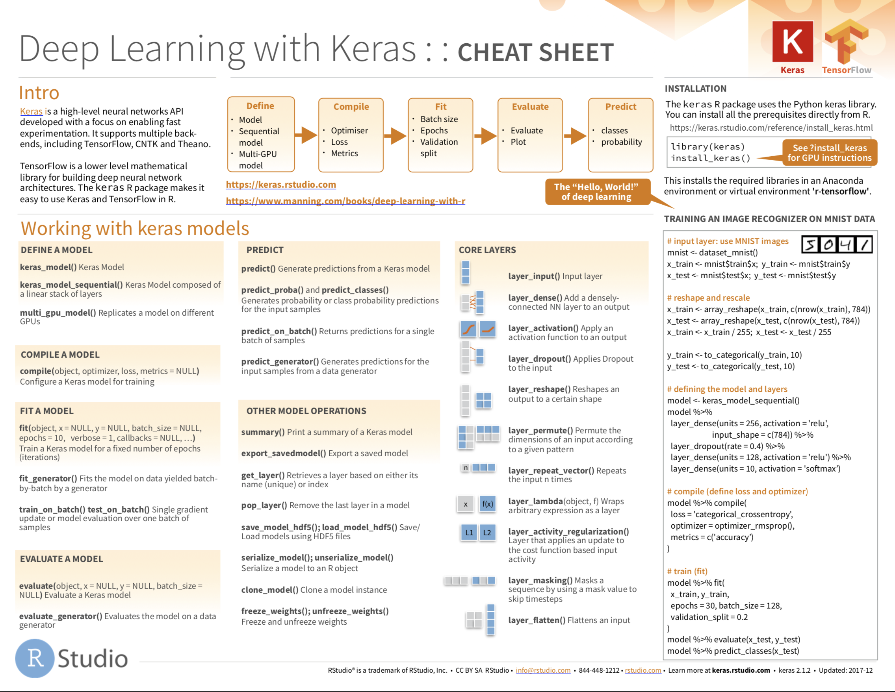

```{r setup, echo = FALSE, include=FALSE}
knitr::opts_chunk$set(comment = NA, 
                      fig.width = 6, 
                      fig.height = 6,
                      fig.align = 'center',
                      echo = FALSE, 
                      eval = FALSE, 
                      warning = FALSE,
                      message = FALSE)

options(digits = 3)

require(tidyverse)
require(caret)
require(party)
require(partykit)

# fashion <- readRDS(file = "../neuralnets/1_Data/fashion.RDS")
# source("../neuralnets/2_Code/helper.R")

```

<p align="center">

</p>

# {.tabset}

## Overview

By the end of this practical you will know how to:

1. Use `Keras` to build deepforward neural networks. 
2. Use `Keras` to fit and evaluate deepforward neural networks.  .
3. Use `Keras` to optimize the predictive performance of deepforward neural networks. 

## Tasks

### A - Setup

1. Open your `TheRBootcamp` R project. 

2. Open a new R script. Save it as a new file called `deep_nn_practical.R` in the `2_Code` folder.  

```{r}
# Done!
```

3. Using `library()` load the the packages `tidyverse` and `keras`

```{r, echo = TRUE, eval = TRUE, message = FALSE}
# install.packages("tidyverse")
# install.packages("keras")

# Load packages necessary for this exercise
library(tidyverse)
library(keras)
```

4. Run the code below to load the `fashion.RDS` dataset as a new object.

```{r, echo = TRUE, message = FALSE, warning = FALSE}
# MNIST fashion data
fashion <- readRDS(file = "1_Data/fashion.RDS")
```

5. Take a look at the contents of the `fashion` object using `str()`. You will see a list with two elements named `train` and `test`, which consist of two elements `x` (the images) and `y` (the item depicted). 

```{r, echo = TRUE}
# Inspect contents
str(fashion)
```

6. Now `source()` the `helper.R` file in your `2_Code` folder.

```{r, echo = TRUE}
# Load helper.R
source("2_Code/helper.R")
```


### B - Data preprocessing

1. Before you get started modeling the data using neural networks, some preprocessing needs to be done. First, split into its individual elements that is into `images` and `items` separately for training and test. Use the code below. 

```{r, echo = TRUE}
# split digit  train
c(fashion_train_images, fashion_train_items) %<-% fashion$train

# split digit  test
c(fashion_test_images, fashion_test_items) %<-% fashion$test
```

3. Now use the `array_reshape` function to serialize the images of both training and test, such that every image is a vector of `28*28=784` elements (and resulting object a matrix with that many columns). Use the code below.

```{r, echo = TRUE}
# reshape images
fashion_train_images_serialized <- array_reshape(fashion_train_images, c(nrow(fashion_train_images), 784))
fashion_test_images_serialized <- array_reshape(fashion_test_images, c(nrow(fashion_test_images), 784))
```

4. Also normalize the images by dividing them by 255, the maximum greyscale value.

```{r, echo = TRUE}
# rescale images
fashion_train_images_serialized <- fashion_train_images_serialized / 255
fashion_test_images_serialized <- fashion_test_images_serialized / 255
```

5. Now, expand the criterion, such that instead of a single integer, the criterion is a one-hot coded vector, with a `1` sitting in the position of the integer and `0`s otherwise.

```{r, echo = TRUE}
# expand criterion
fashion_train_items_onehot <- to_categorical(fashion_train_items, 10)
fashion_test_items_onehot <- to_categorical(fashion_test_items, 10)
```

6. Use `head(fashion_train_items_onehot)` to inspect the first few rows and compare them to `head(fashion_train_items)`. Do things line up?

### C - Illustrate

1. Before visualizing the images, create a vector that contains the labels for the 10 different fashion items. 

```{r, echo = TRUE}
# fashion items
fashion_labels = c('T-shirt/top',
                   'Trouser',
                   'Pullover',
                   'Dress',
                   'Coat', 
                   'Sandal',
                   'Shirt',
                   'Sneaker',
                   'Bag',
                   'Ankle boot')
```

2. Now use the `plt_imgs()` function, which you have loaded earlier with the `helper.R` script, to illustrate the images. You have add a `1`, because the indices in `fashion_train_items` start at `0`.

```{r, echo = TRUE}
# rescale images
plt_imgs(fashion_train_images[1:25,,],fashion_labels[fashion_train_items[1:25]+1])
```


### D - Build network

1. Alright, use `keras_model_sequential()` to start building a network.

```{r, echo = TRUE}
# begin building network
net <- keras_model_sequential()
```

2. Ok, for now, let us build the most simple model with single input and output layers. To do this, add a single `layer_dense()`. Inside the function you will have to specify three arguments: `input_shape` and `activation`. For a moment, think about what values to use for these three given the kind of data that you wish to model. The answers come in a sec. 

```{r, echo = TRUE, eval = FALSE}
# add layer
net %>% layer_dense(
  input_shape = XX,
  units = XX,
  activation = "XX"
  )
```

3. The correct solutions are `input_shape = 784` to specify that there must be`784` input nodes, one for each pixel, `units =  10` to specify that there must be 10 different output nodes, and `activation = 'softmax'` to specify that the final activation should be a probability that sums to `1` across all output nodes. After you have entered these values, use `summary(net)` to see the model information.

```{r}
# add layer
net %>% layer_dense(
  input_shape = 784,
  units = 10,
  activation = "softmax"
  )

# model information
summary(net)
```

4. Take a look at the `Param #` column in the print out. Why is the number `7850` rather than `7840 = 784 * 10`? Any ideas?

5. Yes, `keras` automatically adds a biases to each node in a layer.  

### E - Compile network

1. Use `compile()` to compile the network. You will need to specify at least two arguments: `optimizer` and `loss`. Think about what we've used in the presentation. Would the same values make sense here? 

```{r, echo = TRUE, eval = F}
# loss, optimizers, & metrics
net %>% compile(
  optimizer = 'XX', 
  loss = 'XX',
  metrics = c('accuracy')
  )
```

2. Yes, the fashion dataset has exactly the same properties as the digit dataset. So, plug in `optimizer = 'adam'` and `loss = categorical_crossentropy` and run the chunk. You see I've also added `'accuracy'` as an additional metric, which can be useful to track during fitting, as it is much easier to interpret than `crossentropy`.   

```{r}
# loss, optimizers, & metrics
net %>% compile(
  optimizer = 'adam', 
  loss = 'categorical_crossentropy',
  metrics = c('accuracy')
  )
```

### F - Fit network

1. You've come to the point where the magic happens. Fit the network using `fit()`. Specify, the arguments `x`, `y`, `batch_size`, and `epoch`. Think for a moment, what the appropriate values for these arguments could be.   

```{r, echo = TRUE, eval = F}
# loss, optimizers, & metrics
history <- net %>% fit(
  x = XX, 
  y = XX,
  batch_size = XX,
  epochs = XX
  )
```

2. The arguments `x` and `y` specify the training features and training criterion, respectively, so `x = fashion_train_images_serialized` and `y = fashion_train_items_onehot`. The arguments `batch_size` and `epochs` control how often the weights will be updated and for how many iterations of the data set. Useful (and somewhat arbitrary) values are `batch_size = 32` and `epochs = 10`. Use these values and then run the chunk.     

```{r}
# fit the network
history <- net %>% fit(
  x = fashion_train_images_serialized, 
  y = fashion_train_items_onehot,
  batch_size = 32,
  epochs = 10
  )
```

3. The `fit` function automatically provides with useful information on the progression of fit indices. You can additionally use the `history` object to get the same illustration to create a `ggplot`. Run `plot(history) + theme_minimal()`. When you inspect the plot, what tells you that the network indeed has learned? And how good is the final performance of the network?

4. The network has learned, which can be gathered by the decrease in `loss` and the increase in `accuracy`. The non-linear pattern is very characteristic, almost always most of the gains are achieved in the first epoch or two. To get accurate values on the final performance you can simply print `history`. What do you think, how well will this network perform in predicting fashion items out-of-sample? Find out in the next section. 

### G - Evaluate network 

1. Evaluation of the performance of neural networks should always only be done on the basis of true prediction, using data that was not used during training. Evaluate the networks predictive performance using `evaluate()` while supplying the function with the test images and items.   

```{r, echo = TRUE, eval = FALSE}
# evaluate
net %>% evaluate(XX, XX, verbose = 0)
```


```{r}
# evaluate
net %>% evaluate(fashion_test_images_serialized, 
                 fashion_test_items_onehot, 
                 verbose = 0)
```

2. The network is slightly worse than in training, but still pretty good given that guessing performance is only `10%` accuracy. This, again, is very characteristic. In machine learning "simple" models often get a long way towards the desired level of performance. Though, one might question whether a model with 750 parameters can still be considered "simple".

3. Compare the predictions made by the network with the actual fashion labels. Do you note any patterns? Can you maybe understand the errors that the network has made. 

```{r, echo = T}
# compare predictions to truth
pred = net %>% predict(fashion_test_images_serialized) %>% k_argmax() %>% as.numeric()
table(fashion_labels[fashion_test_items+1], fashion_labels[pred+1])

```

### H - Build & evaluate deeper network

1. Build a deeper neural network with two hidden, fully-connected layers with 256 and 128 units, respectively, and a `'relu'` activation function. See template below. The final layer will again be the output layer and must be supplied with the same values as before. Plot the summary at the end.

```{r, echo = TRUE}
# initialize deepnet
deepnet <- keras_model_sequential()

# add layers
deepnet %>% 
  layer_dense(input_shape = 784, units = XX, activation = "XX") %>% 
  layer_dense(units = XX, activation = "XX") %>% 
  layer_dense(units = XX, activation = "XX")

# model information
summary(deepnet)
```

```{r}
# initialize deepnet
deepnet <- keras_model_sequential()

# add layer
deepnet %>% 
  layer_dense(input_shape = 784, units = 256, activation = "relu") %>% 
  layer_dense(units = 128, activation = "relu") %>% 
  layer_dense(units = 10, activation = "softmax")

# model information
summary(deepnet)
```

2. How many parameters are there now in the network?

3. A whole lot more parameters. There are more than 300 times as many parameters as before. Let's see what this network can achieve. Compile and train the network using the exact same steps as before and then evaluate the network on the test data. The only change in the code you need to make is to replace `net` with `deepnet`.

```{r}
# loss, optimizers, & metrics
deepnet %>% compile(
  optimizer = 'adam', 
  loss = 'categorical_crossentropy',
  metrics = c('accuracy')
  )

# fit network
history <- deepnet %>% fit(
  x = fashion_train_images_serialized, 
  y = fashion_train_items_onehot,
  batch_size = 32,
  epochs = 10
  )

# evaluate
deepnet %>% evaluate(fashion_test_images_serialized, 
                     fashion_test_items_onehot, 
                     verbose = 0)
```

4. The test performance has improved by about 7% points. Not bad. Also the drop from fitting to testing performance is small suggesting minimal overfitting of the data. Let's the see how far we can take it. Let's build a real deep network  

### I - Build & evaluate real deep network

1. Build a real deep network with two additional 256-node layers, two additional 128-node layer, and three additional layers 64-node layers. In the end, there should be three layers of each kind, sorted, as before, in descending order of the number of nodes. Take a look at the summary. 

```{r, echo = TRUE}
# initialize realdeepnet
realdeepnet <- keras_model_sequential()

# add layers
realdeepnet %>% 
  layer_dense(input_shape = 784, units = XX, activation = "XX") %>% 
  layer_dense(units = XX, activation = "XX") %>% 
  layer_dense(units = XX, activation = "XX") %>% 
  layer_dense(units = XX, activation = "XX") %>% 
  layer_dense(units = XX, activation = "XX") %>% 
  layer_dense(units = XX, activation = "XX") %>% 
  layer_dense(units = XX, activation = "XX") %>% 
  layer_dense(units = XX, activation = "XX") %>% 
  layer_dense(units = XX, activation = "XX") %>% 
  layer_dense(units = XX, activation = "XX")

# model information
summary(realdeepnet)
```


```{r}
# initialize deepnet
realdeepnet <- keras_model_sequential()

# add layer
realdeepnet %>% 
  layer_dense(input_shape = 784, units = 256, activation = "relu") %>% 
  layer_dense(units = 256, activation = "relu") %>%
  layer_dense(units = 256, activation = "relu") %>%
  layer_dense(units = 128, activation = "relu") %>% 
  layer_dense(units = 128, activation = "relu") %>%
  layer_dense(units = 128, activation = "relu") %>%
  layer_dense(units = 64, activation = "relu") %>% 
  layer_dense(units = 64, activation = "relu") %>% 
  layer_dense(units = 64, activation = "relu") %>% 
  layer_dense(units = 10, activation = "softmax")

# model information
summary(realdeepnet)
```

2. The number of parameters in network only increased by a factor of 2, because the lion share stems from the weights between the input and the first hidden layer, which remained unchanged. Nonetheless, there is reason to believe that this network fares differently. Try it out using the exact same steps as before.   

```{r}
# loss, optimizers, & metrics
realdeepnet %>% compile(
  optimizer = 'adam', 
  loss = 'categorical_crossentropy',
  metrics = c('accuracy')
  )

# fit network
history <- realdeepnet %>% fit(
  x = fashion_train_images_serialized, 
  y = fashion_train_items_onehot,
  batch_size = 32,
  epochs = 10
  )

# evaluate
realdeepnet %>% evaluate(fashion_test_images_serialized, 
                         fashion_test_items_onehot, 
                         verbose = 0)
```

3. The model did not fare a whole lot better. The fit performance increased a bit, but the predictive accuracy more or less remained constant. Fit the model again. To do this you can simply run the fit function again, which will lead to a continuation of training from where training ended before. After training has finished, evaluate the predictive accuracy again.

4. Not all too much happening. Though, both fitting and prediction performance went up by another notch. This is again characteristic of neural networks. To really max out on performance, many epochs of training will often be necessary. However, at the same time risks to give the model opportunity to overfit the data. 

### J - Battling overfitting

1. To begin with create a `crazycomplexnet` which should have twice as many nodes in the first hidden layer than there are input nodes. Add as many hidden layers as you like and then run the network for `20` epochs for a batch size of `100` and evaluate the network's performance. 

```{r, echo = TRUE}
# initialize crazycomplexnet
crazycomplexnet <- keras_model_sequential()

# add layers
crazycomplexnet %>% 
  layer_dense(input_shape = 784, units = 1568, activation = "relu") %>% 
  layer_dense(units = XX, activation = "XX") %>% 
  layer_dense(units = 10, activation = "softmax")

# model information
summary(crazycomplexnet)
```

```{r}
# initialize crazycomplexnet
crazycomplexnet <- keras_model_sequential()

# add layers
crazycomplexnet %>% 
  layer_dense(input_shape = 784, units = 1568, activation = "relu") %>% 
  layer_dense(units = 784, activation = "relu") %>% 
  layer_dense(units = 10, activation = "softmax")

# model information
summary(crazycomplexnet)

# loss, optimizers, & metrics
crazycomplexnet %>% compile(
  optimizer = 'adam', 
  loss = 'categorical_crossentropy',
  metrics = c('accuracy')
  )

# fit network
history <- crazycomplexnet %>% fit(
  x = fashion_train_images_serialized, 
  y = fashion_train_items_onehot,
  batch_size = 100,
  epochs = 20
  )

# evaluate
crazycomplexnet %>% evaluate(fashion_test_images_serialized, 
                         fashion_test_items_onehot, 
                         verbose = 0)
```

2. This should have upped the fitting performance, but possibly hurt the prediction performance. See whether adding `layour_dropout(rate = .3)` in between the `layer_dense()` helps preserve some more of the fitting performance for test. Layer dropout sets the activation of a random subset of nodes to zero, which effectively eliminates momentarily the weights emitting from the node and, thus, constrains model flexibility.  

```{r, echo = TRUE, eval = FALSE}
# initialize crazycomplexnet
crazycomplexnet <- keras_model_sequential()

# add layers
crazycomplexnet %>% 
  layer_dense(input_shape = 784, units = 1568, activation = "relu") %>% 
  layer_dropout(rate = XX) %>% 
  layer_dense(units = XX, activation = "XX") %>% 
  layer_dropout(rate = XX)
  layer_dense(units = 10, activation = "softmax")

# model information
summary(crazycomplexnet)
```

## Resources

### Cheatsheet

<figure>
<center>
<a href="https://github.com/rstudio/cheatsheets/raw/master/keras.pdf">
  </a><br>
 <font style="font-size:10px"> from <a href= "https://rstudio.com/resources/cheatsheets/">github.com/rstudio</a></font>
</figure>

