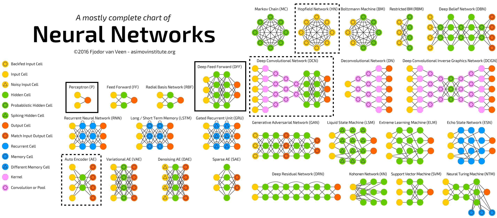
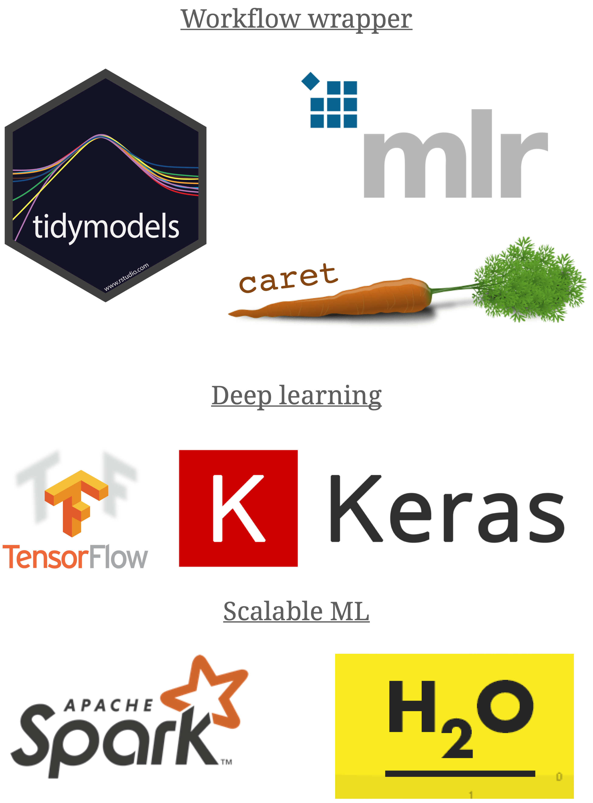
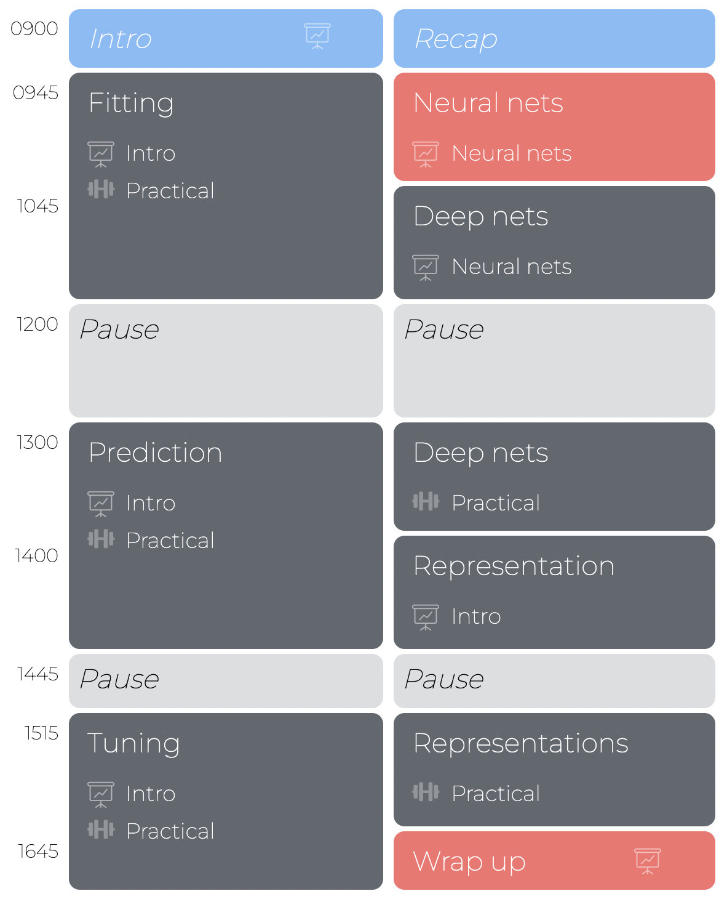

layout: true

<div class="my-footer">
  <span style="text-align:center">
    <span> 
      
    </span>
    <a href="https://therbootcamp.github.io/">
      <span style="padding-left:82px"> 
        <font color="#7E7E7E">
          www.therbootcamp.com
        </font>
      </span>
    </a>
    <a href="https://therbootcamp.github.io/">
      <font color="#7E7E7E">
      Machine Learning with R @ DHLab  | September 2022
      </font>
    </a>
    </span>
  </div> 

---


```{r setup, include=FALSE}
options(htmltools.dir.version = FALSE)
options(width=110)
options(digits = 4)

knitr::opts_chunk$set(fig.align = 'center')
```

.pull-left6[

<br><br><br><br>


# Aim

<br>

> <font style='font-size:40px;font-family:"Yanone Kaffeesatz";font-weight:500'>The aim of this workshop is enable you to thoughtfully implement supervised machine learning methods, using tidymodels (day 1) and keras (day 2) in R.</font>

]

.pull-right4[

<br><br><br><br>
<p align="center"></p>

]


---

# What is machine learning?

.pull-left45[

<b>Machine learning is</b>...


</p>


]


.pull-right45[

<p align = "center">
<br>
<font style="font-size:10px">from <a href="https://medium.com/@dkwok94/machine-learning-for-my-grandma-ca242e97ef62">medium.com</a></font>
</p>


]

---

# What is machine learning?

.pull-left45[

<b>Machine learning is</b>...

<p style="padding-left:20px">

...a <high>field of artificial intelligence</high>...<br><br> 

...that uses <high>statistical techniques</high>... <br><br>

...to allow computer systems to <high>"learn"</high>,...<br><br>

...i.e., to progressively <high>improve performance</high> on a specific task...<br><br>

...from small or large amounts of <high>data</high>,... <br><br>

....<high>without being explicitly programmed</high>....<br><br>

....with the goal to <high>discover structure</high> or </high>improve decision making and predictions</high>.

</p>


]


.pull-right45[

<p align = "center">
<br>
<font style="font-size:10px">from <a href="https://medium.com/@dkwok94/machine-learning-for-my-grandma-ca242e97ef62">medium.com</a></font>
</p>


]


---

.pull-left3[

# Types of machine learning tasks


<ul>
  <li class="m1"><span>There are many types of machine learning tasks, each of which call for different models.</span></li>
  <li class="m2"><span><high>We will focus on supervised machine learning</high>.</span></li>
</ul>

]

.pull-right65[

<br><br>

<p align = "center">
<br>
<font style="font-size:10px">from <a href="image/mltypes.png">amazonaws.com</a></font>
</p>
]


---

# Supervised learning

.pull-left45[

<ul>
  <li class="m1"><span><high>The <high>dominant type</high> of machine learning.</span></li>
  <li class="m2"><span>Supervised learning uses <high>labeled data</high> to learn <high>a model</high> that relates the criterion to the features.</span></li>
</ul>


]

.pull-right45[

<p align = "center">
<br>
</p>
]


---

# 2 types of supervised problems

.pull-left5[

There are two types of supervised learning problems typically can be approached <high>using the same model</high>.

<font style="font-size:24px"><b>Regression</b></font>

Regression problems involve the <high>prediction of a quantitative feature</high>. 

E.g., predicting the cholesterol level as a function of age. 

<font style="font-size:24px"><b>Classification</b></font>

Classification problems involve the <high>prediction of a categorical feature</high>.   

E.g., predicting the origin of chest pain as a function of age and heart attack risk. 


]

.pull-right4[

<p align = "center">
<br>
</p>

]

---

# Three supervised algorithms

<p align="center"><br>

</p>


---

# Neural networks

<p align = "center">
<br>
<font style="font-size:10px">adapted from <a href="asimovinstitute.com">asimovinstitute.com</a></font>
</p>


---

.pull-left4[

# ML in R

<ul>
  <li class="m1"><span>R has advanced tremendously with respect to ML.</span></li>
  <li class="m2"><span>There exist <high>powerful and user-friendly</high> tools for all ML steps and algorithms.</span></li>
</ul>


]

.pull-right5[

<p align = "center">
<br><br>
<br>
</p>

]


---

.pull-left4[

# Schedule 

<ul>
  <li class="m1"><span><high>Schedule</high>
  <br><br>
  <ul class="level">
    <li><span>Intro to R</span></li>
    <li><span>3 blocks on ML with R</span></li>
  </ul>
  </span></li>
  <li class="m2"><span><high>Block</high>
  <br><br>
  <ul class="level">
    <li><span>Slide-based introduction</span></li>
    <li><span>Many exercises</span></li>
  </ul>
  </span></li>
</ul>


]

.pull-right45[
<br><br>


]


---

.pull-left45[

# Introduction


<ul>
  <li class="m1"><span><high>Introduction</high>
  <br><br>
  <ul class="level">
    <li><span>30-45 min</span></li>
    <li><span>Concepts & Code examples</span></li>
  </ul>
  </span></li>
  <li class="m2"><span><high>Materials</high>
  <br><br>
  <ul class="level">
    <li><span>Permanently <a href="https://therbootcamp.github.io/EDA_2019CSS/">available online</a></span></li>
    <li><span>PDFs will be available later</span></li>
  </ul>
  </span></li>
</ul>

]

.pull-right55[

<br>

<p align="center">

<br>
<font style="font-size:10px">from <a href="www.Freepik.com">Freepik.com</a></font>
</p>

<p align="center">

<br>
<font style="font-size:10px">from <a href="www.Freepik.com">Freepik.com</a></font>
</p>

]


---

.pull-left45[

# Practicals


<ul>
  <li class="m1"><span><high>Write your own scripts</high>
  <br><br>
  <ul class="level">
    <li><span>20 - 50 tasks</span></li>
    <li><span>Increasingly getting difficult.</span></li>
    <li><span>Follow your own tempo.</span></li>
    <li><span>Answers are added later.</span></li>
  </ul>
  </span></li>
</ul>

]

.pull-right5[
<br>

  <iframe src="https://therbootcamp.github.io/AML_2020AMLD/_sessions/Fitting/Fitting_practical.html" height="480px" width = "500px"></iframe>

  Example: <a href="https://therbootcamp.github.io/AML_2020AMLD/_sessions/Fitting/Fitting_practical.html">Fitting Practical </a>

]

---

.pull-left4[
# Introductions

1. Who are you?

2. Why do you want to learn about ML with R?

3. How much experience do you have with ML and R?

4. What's your favorite algorithm (ML or non-ML)?

]

.pull-right50[

<p align="center"><br><br><br><br>

<br>
<font style="font-size:10px">from <a href="https://unsplash.com/photos/SymZoeE8quA">unsplash.com</a></font>
</p>

]

---

class: middle, center

<h1><a href=https://therbootcamp.github.io/ML_2022DHLab/index.html>Schedule</a></h1>

