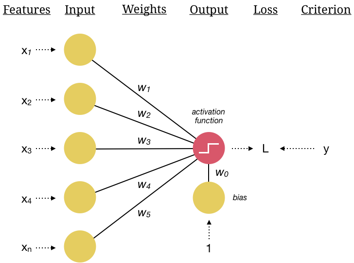
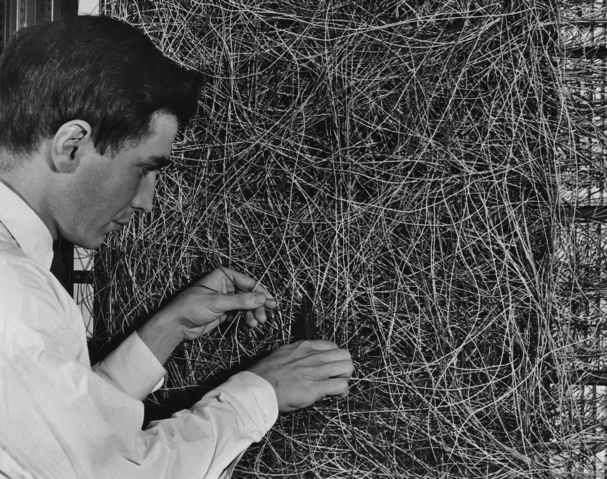
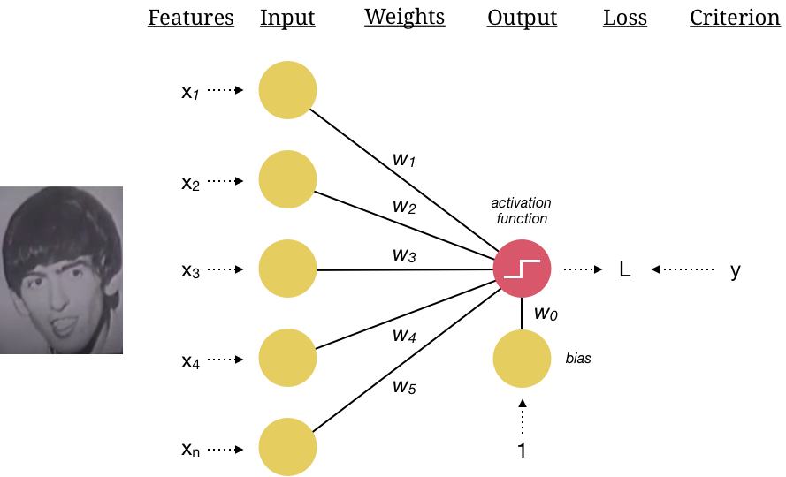
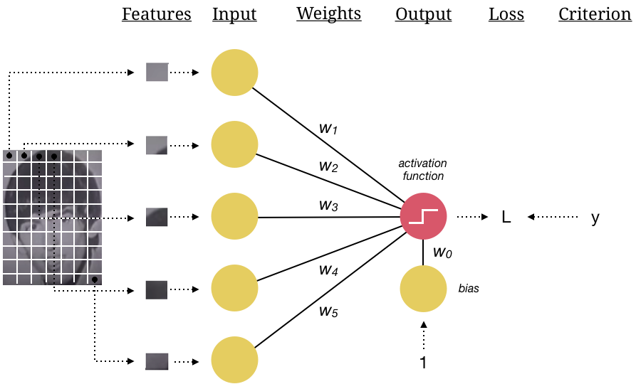
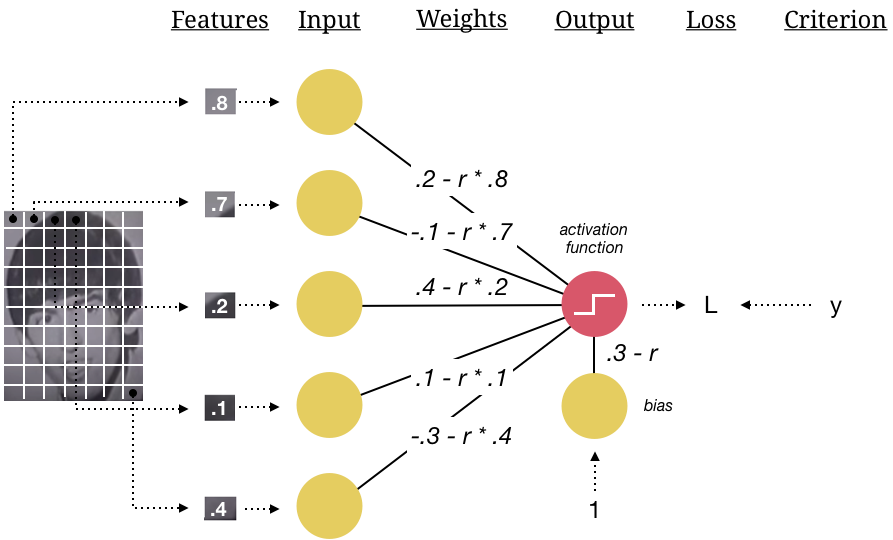
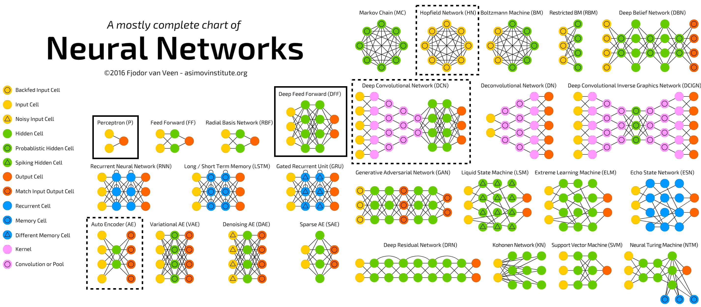
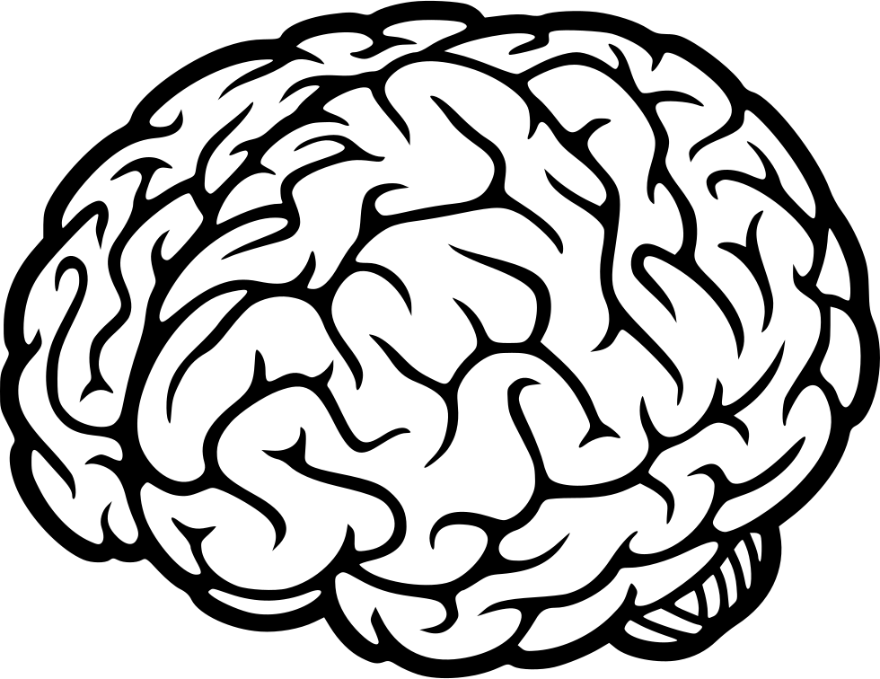
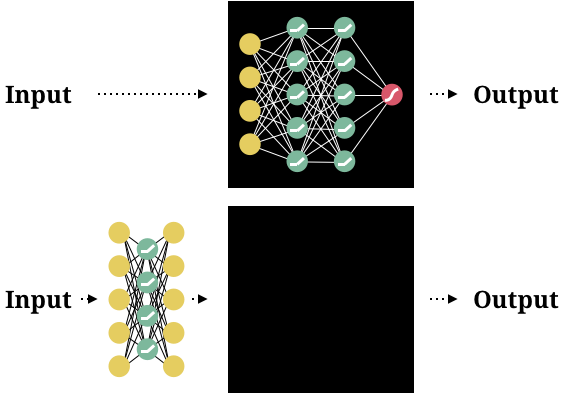
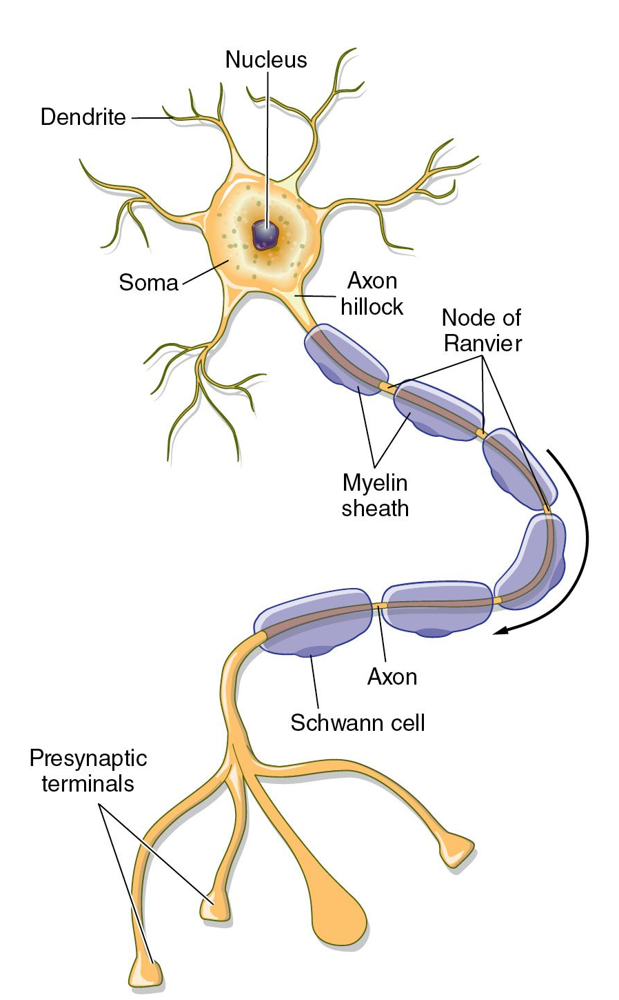
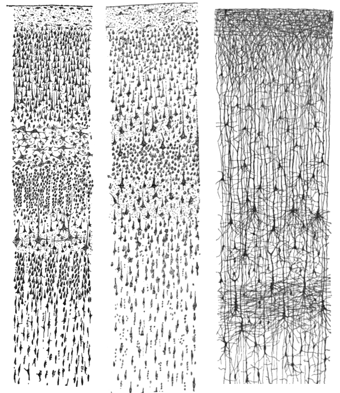

layout: true

<div class="my-footer">
  <span style="text-align:center">
    <span> 
      
    </span>
    <a href="https://therbootcamp.github.io/">
      <span style="padding-left:82px"> 
        <font color="#7E7E7E">
          www.therbootcamp.com
        </font>
      </span>
    </a>
    <a href="https://therbootcamp.github.io/">
      <font color="#7E7E7E">
      Machine Learning with R @ DHLab  | September 2022
      </font>
    </a>
    </span>
  </div> 

---

class: middle, center

```{r setup, include=FALSE}
options(htmltools.dir.version = FALSE)
options(width=110)
options(digits = 4)
library(tidyverse)
```


# What do you think?

---

# Back in the 50s and 60s


<div align="center">
<iframe width="800" height="450" src="https://www.youtube.com/embed/cNxadbrN_aI?rel=0" frameborder="0" allow="accelerometer; autoplay; encrypted-media; gyroscope; picture-in-picture" allowfullscreen></iframe>
</div>


---

# Perceptron

.pull-left35[


<ul>
  <li class="m1"><span>Developed by <high>Frank Rosenblatt</high> in 1958.</span></li>
  <li class="m2"><span>The first <high>feedforward neural network</high>.</span></li>
  <li class="m3"><span>Consists of...</span></li>
  <ul>
    <li><span>An <high>input layer</high> of nodes.</span></li>
    <li><span>A <high>bias</high>.</span></li>
    <li><span><high>Weights</high> projecting the inputs to a single output node.</span></li>
    <li><span>A single <high>output neuron with a <high>step activation</high> function.</span></li>
    <li><span>A <high>loss</high> function.</span></li>
    <li><span>A rule for <high>updating</high>.</span></li>
  </ul>
</ul>


]

.pull-right6[

<p align = "right">
<br>
</p>

]


---

# Perceptron

.pull-left35[


<ul>
  <li class="m1"><span>Developed by <high>Frank Rosenblatt</high> in 1958.</span></li>
  <li class="m2"><span>The first <high>feedforward neural network</high>.</span></li>
  <li class="m3"><span>Consists of...</span></li>
  <ul>
    <li><span>An <high>input layer</high> of nodes.</span></li>
    <li><span>A <high>bias</high>.</span></li>
    <li><span><high>Weights</high> projecting the inputs to a single output node.</span></li>
    <li><span>A single <high>output neuron with a <high>step activation</high> function.</span></li>
    <li><span>A <high>loss</high> function.</span></li>
    <li><span>A rule for <high>updating</high>.</span></li>
  </ul>
</ul>


]

.pull-right6[

<p align = "center">
<br>
<font style="font-size:10px">Rosenblatt with Perceptron, adapted from <a href="https://www.nzz.ch/digital/ehre-fuer-die-deep-learning-mafia-ld.1472761">nzz.ch</a></font>
</p>

]

---

# Input

.pull-left3[

<ul>
  <li class="m1"><span>Inputs take information from features, implying typically <high>n(features) = n(inputs)</high>.</span></li>
  <li class="m2"><span>Typically a <high>bias</high> is added as one extra input.</span></li>
  <li class="m3"><span>Higher dimensional inputs are typically <high>flattened to 1D</high>.</span></li>
  <li class="m4"><span>Images are translated into <high>grey values</high> or rgb.</span></li>
</ul>

]

.pull-right6[

<p align = "right">
<br>
</p>

]

---

# Input

.pull-left3[

<ul>
  <li class="m1"><span>Inputs take information from features, implying typically <high>n(features) = n(inputs)</high>.</span></li>
  <li class="m2"><span>Typically a <high>bias</high> is added as one extra input.</span></li>
  <li class="m3"><span>Higher dimensional inputs are typically <high>flattened to 1D</high>.</span></li>
  <li class="m4"><span>Images are translated into <high>grey values</high> or rgb.</span></li>
</ul>

]

.pull-right6[

<p align = "right">
<br>
</p>

]

---

# Input

.pull-left3[

<ul>
  <li class="m1"><span>Inputs take information from features, implying typically <high>n(features) = n(inputs)</high>.</span></li>
  <li class="m2"><span>Typically a <high>bias</high> is added as one extra input.</span></li>
  <li class="m3"><span>Higher dimensional inputs are typically <high>flattened to 1D</high>.</span></li>
  <li class="m4"><span>Images are translated into <high>grey values</high> or rgb.</span></li>
</ul>

]

.pull-right6[

<p align = "right">
<br>
</p>

]

---

# Weights

.pull-left3[

<ul>
  <li class="m1"><span>Weights <high>project the input</high> to the next/final layer.</span></li>
  <li class="m2"><span>Typically initialized to small <high>random values</high>.</span></li>
</ul>

]

.pull-right6[

<p align = "right">
<br>
</p>

]


---

# Output

.pull-left3[

<ul>
  <li class="m1"><span>A <high>linear combination</high> of the projecting inputs and their weights passed thorough a <high>step activation</high> function.</span></li>
</ul>

<p style="padding-top:20px"><u>Output activation</u></p>

$$\begin{align*}  a^L &= \sigma(z^{L}) = \sigma(w^\intercal a^{L-1}) \\ & =\sigma(w_1 \cdot a^{L-1}_1 + \cdots + w_j \cdot a^{L-1}_j) \\ & =\sigma(w_1 \cdot x_1+ \cdots + w_j \cdot x_j) \end{align*}$$


<p style="padding-top:20px"><u>Step activation function</u></p>

$$\sigma(z) = {\begin{cases}{}
        0, & \text{for } z \leq 0 \\
        1, & \text{for } z > 0 \end{cases}}$$

]

.pull-right6[

<p align = "right">
<br>
</p>

]


---

# Loss

.pull-left3[

<ul>
  <li class="m1"><span>Loss summarizes the <high>mismatch between the output activation and the criterion</high>.</span></li><br>
  <li class="m2"><span>Loss is used as a <high>means to update the weights</high>.</span></li>
</ul>

$$L_i(w_t) = y_i - \sigma(w_t^\intercal x_i)$$

]

.pull-right6[

<p align = "right">
<br>
</p>

]


---

# Update

.pull-left3[

<ul>
  <li class="m1"><span>A given weight is <high>updated proportional to the loss</high>, the input that is projected by the weight, and a learning rate <mono>r</mono>.</span></li><br>
</ul>

<p style="padding-top:20px"><u>Weight updating</u></p>

$$\large w^{t+1}_j = w^t_{j} + r \cdot L_i \cdot x_{ji}$$

]

.pull-right6[

<p align = "right">
<br>
</p>

]

---

# Today...


<p align = "center">
<br>
<font style="font-size:10px">adapted from <a href="asimovinstitute.com">asimovinstitute.com</a></font>
</p>


---

# Why should you care?

.pull-left2[

<br><br><br><br>

<ul>
  <li class="m1"><span>Predictive tools</span></li><br>
  <li class="m2"><span>Representations</span></li><br>
  <li class="m3"><span>Models of the mind</span></li>
</ul>
]

.pull-right7[

<br>

<p align = "center">
<br>
<font style="font-size:10px">from <a href="https://favpng.com/png_view/brain-human-brain-cognitive-science-neural-oscillation-clip-art-png/2UjbFG8S">favpng.com</a></font>
</p>

]

---

# Predictive tools

.pull-left25[

<br><br>

<ul>
  <li class="m1"><span>What is the <high>upper bound</high> predictability of the output?</span></li><br>
  <li class="m2"><span>How do different <high>inputs contribute</high> to achieving predictive performance?</span></li>
</ul>

]

.pull-right65[

<br>

<p align = "center">
<br>
</p>

]

---

# Representations


.pull-left25[

<br>

<ul>
  <li class="m1"><span>Treat neural network as an <high>as-if model</high> and study the inferred computations.</span></li><br><br><br><br>
  <li class="m2"><span>Use the neural network to extract <high>meaningful representations</high> from the environment.</span></li>
</ul>

]

.pull-right65[


<p align = "center">
<br>
</p>

]

---

# Models of the mind

.pull-left25[

<br><br><br><br>

<ul>
  <li class="m1"><span>Use neural network as an <high>actual model of cognitive processing</high> in the brain.</span></li>
</ul>

]

.pull-right65[

<br><br>

<p align = "center">
<br>
</p>

]


---

.pull-left4[

# Models of the mind

<p align = "center">
<br>
<font style="font-size:10px">adapted from <a href="pinterest.de">pinterest.de</a></font>
</p>

]

.pull-right5[

<br>

<p align = "center">
<br>
<font style="font-size:10px">by Santiago Ramon y Cajal, from <a href="https://en.wikipedia.org/wiki/Cerebral_cortex">wikipedia.org</a></font>
</p>


]

---

class: middle, center

<h1><a href=https://therbootcamp.github.io/ML_2022DHLab/index.html>Schedule</a></h1>

