layout: true

<div class="my-footer">
  <span style="text-align:center">
    <span> 
      
    </span>
    <a href="https://therbootcamp.github.io/">
      <span style="padding-left:82px"> 
        <font color="#7E7E7E">
          www.therbootcamp.com
        </font>
      </span>
    </a>
    <a href="https://therbootcamp.github.io/">
      <font color="#7E7E7E">
      Machine Learning with R @ ARC  | May 2022
      </font>
    </a>
    </span>
  </div> 

---


```{r setup, include=FALSE}
options(htmltools.dir.version = FALSE)
# see: https://github.com/yihui/xaringan
# install.packages("xaringan")
# see: 
# https://github.com/yihui/xaringan/wiki
# https://github.com/gnab/remark/wiki/Markdown
options(width=110)
options(digits = 4)

# Get color palette functions

source("https://raw.githubusercontent.com/therbootcamp/ML_2019Oct/master/_materials/code/baselrbootcamp_palettes.R")
```


```{r, echo = FALSE ,message = FALSE, warning = FALSE}
library(tidyverse)
library(keras)


digit = readRDS('1_Data/digit.RDS')
n = 100
digit[[1]][[1]] = digit[[1]][[1]][1:n,,]
digit[[1]][[2]] = digit[[1]][[2]][1:n]
digit[[2]][[1]] = digit[[2]][[1]][1:n,,]
digit[[2]][[2]] = digit[[2]][[2]][1:n]


```

.pull-left3[

# Why does deep learning work?

<ul>
  <li class="m1"><span>Deep feedforward networks have <high>"many" hidden layers</high>.</span></li>
  <li class="m2"><span>The hidden layers learn <high>useful representations of the inputs</high>.</span></li>
  <li class="m3"><span>The deeper the layer, the <high>more abstract the representation</high>.</span></li>
  <li class="m4"><span>Useful does <high>not mean intuitive</high>.</span></li>
</ul>

]


.pull-right6[


<p align = "center">
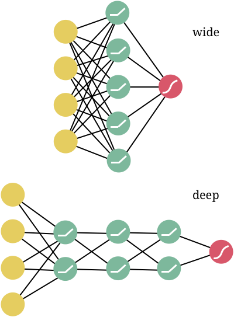<br>
</p>

]

---

.pull-left3[

# MNIST representations

<ul>
  <li class="m1"><span>The <high>activation patterns in the hidden layers</high> reveal how inputs are represented.</span></li><br>
  <li class="m2"><span>Activation patterns can easily be computed using basic <high>matrix algebra</high> (once weights have been determined).</span></li>
</ul>

]


.pull-right6[

<br>

<p align = "center">
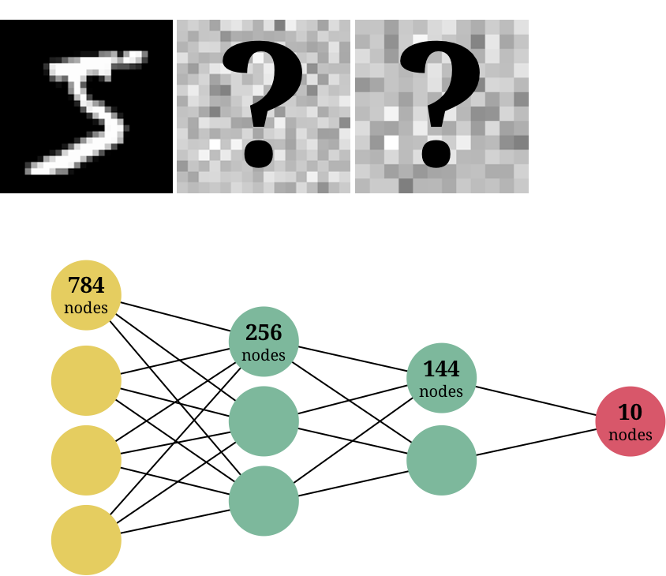<br>
</p>

]

---

.pull-left3[

# MNIST representations

<ul>
  <li class="m1"><span>The <high>activation patterns in the hidden layers</high> reveal how inputs are represented.</span></li><br>
  <li class="m2"><span>Activation patterns can easily be computed using basic <high>matrix algebra</high> (once weights have been determined).</span></li>
</ul>

]


.pull-right6[

<br>

<p align = "center">
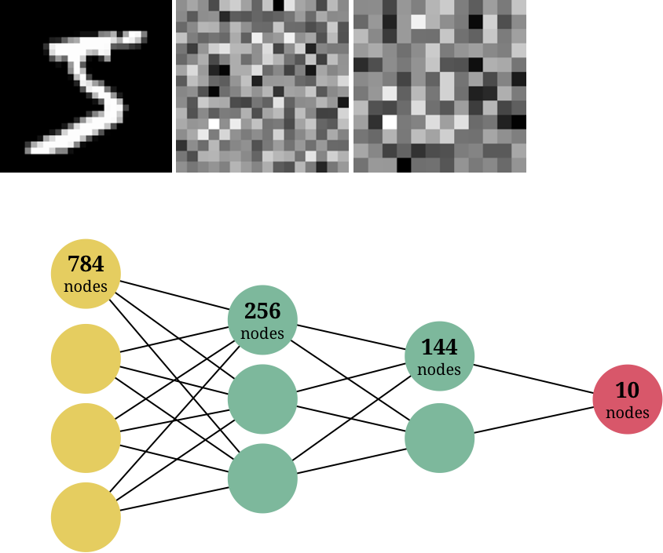<br>
</p>

]

---

.pull-left3[

# MNIST representations

<ul>
  <li class="m1"><span>The <high>activation patterns in the hidden layers</high> reveal how inputs are represented.</span></li><br>
  <li class="m2"><span>Activation patterns can easily be computed using basic <high>matrix algebra</high> (once weights have been determined).</span></li>
</ul>

]


.pull-right6[

<br>

<p align = "center">
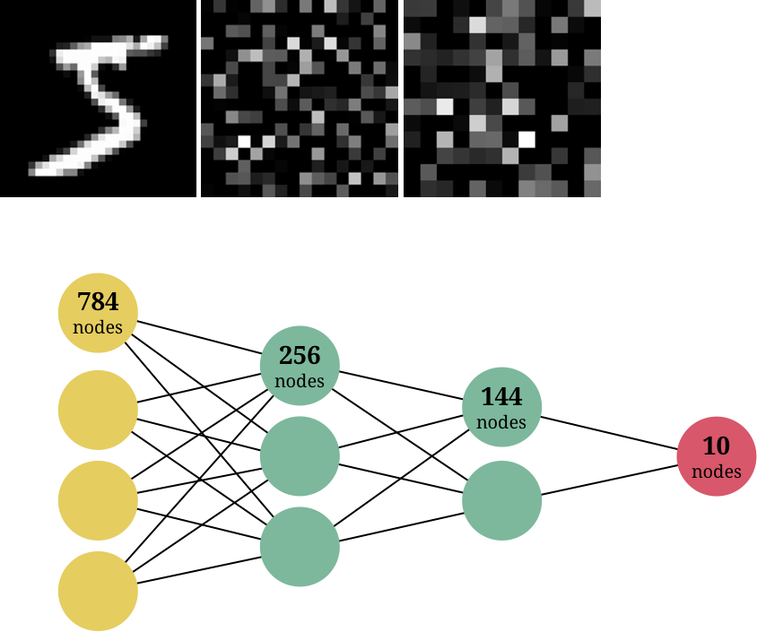<br>
</p>

]

---

# Convolutional neural networks

.pull-left4[

<ul>
  <li class="m1"><span>Convolutional neural networks (CNN) <high>learn input primitives</high>, e.g., lines of different orientations.</span></li><br>
  <li class="m2"><span>Later dense layers <high>recombine primitives</high> to form predictive higher-order characteristics, e.g., shapes.</span></li><br>
  <li class="m3"><span>CNNs are the <high>gold-standard</high> for image processing and <high>object recognition</high>.</span></li>
</ul>

]


.pull-right5[

<p align = "center">
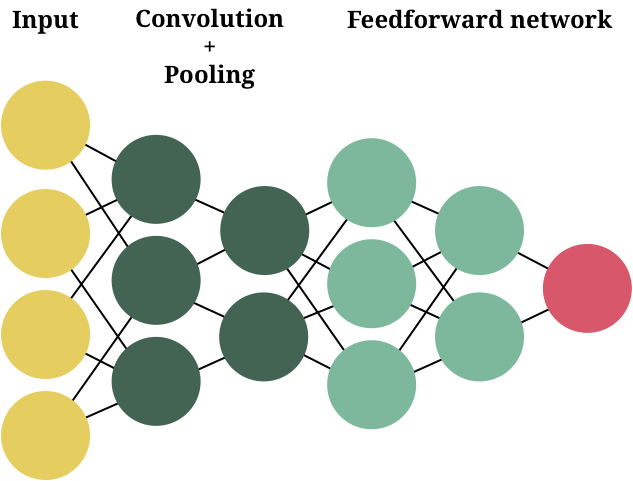<br>
</p>

]

---

<div align="center" style="padding-top:30px">
<iframe width="1200" height="570" src="https://www.youtube.com/embed/3JQ3hYko51Y?rel=0" frameborder="0" allow="accelerometer; autoplay; encrypted-media; gyroscope; picture-in-picture" allowfullscreen></iframe>
</div>


---

.pull-left4[

# Pixel embeddings

<ul>
  <li class="m1"><span>Activation patterns cannot be understood on their own, still they can be used to learn much about inputs by treating them as <high>encodings or embeddings of the inputs</high>.</span></li><br>
  <li class="m2"><span>Embeddings are particcularly useful for studying the <high>patterns of relationships</high> between inputs.</span></li>
</ul>

]


.pull-right5[

<br>

<p align = "center">
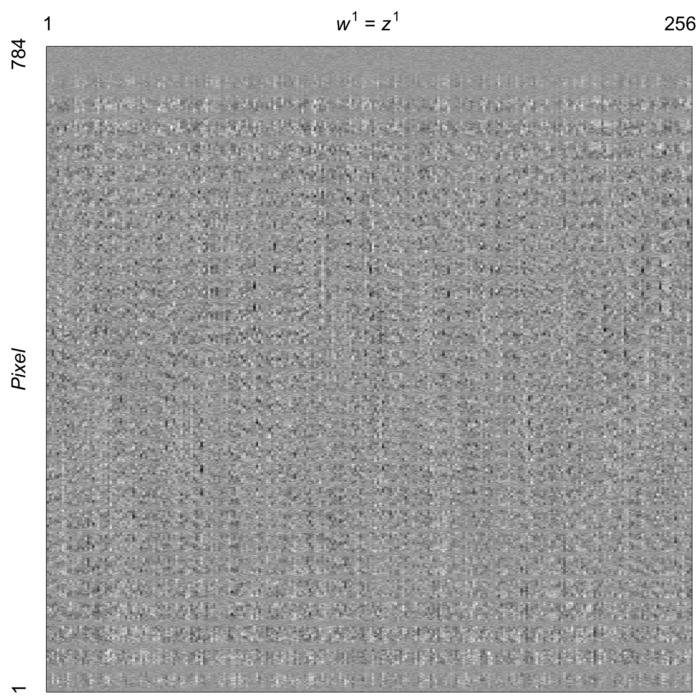<br>
</p>

]


---

.pull-left4[

# Pixel embeddings

<ul>
  <li class="m1"><span>Activation patterns cannot be understood on their own, still they can be used to learn much about inputs by treating them as <high>encodings or embeddings of the inputs</high>.</span></li><br>
  <li class="m2"><span>Embeddings are particcularly useful for studying the <high>patterns of relationships</high> between inputs.</span></li>
</ul>
]


.pull-right5[

<br>

<p align = "center">
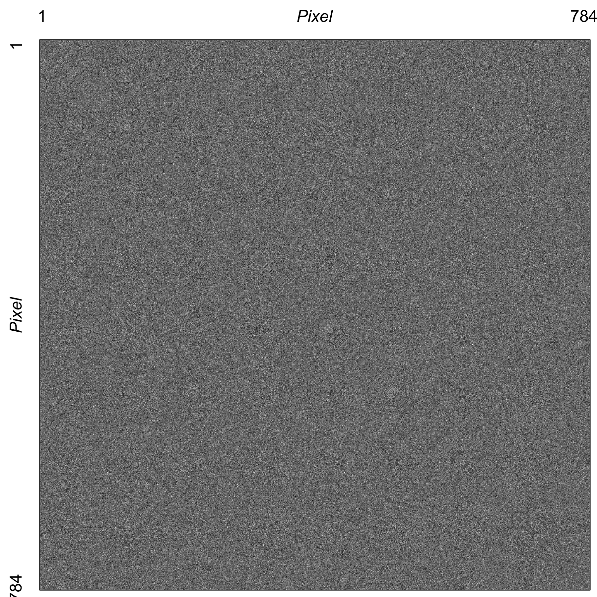<br>
</p>

]


---

.pull-left4[

# Digit embeddings

<ul>
  <li class="m1"><span>Activation patterns cannot be understood on their own, still they can be used to learn much about inputs by treating them as <high>encodings or embeddings of the inputs</high>.</span></li><br>
  <li class="m2"><span>Embeddings are particcularly useful for studying the <high>patterns of relationships</high> between inputs.</span></li>
</ul>

]


.pull-right5[

<br>

<p align = "center">
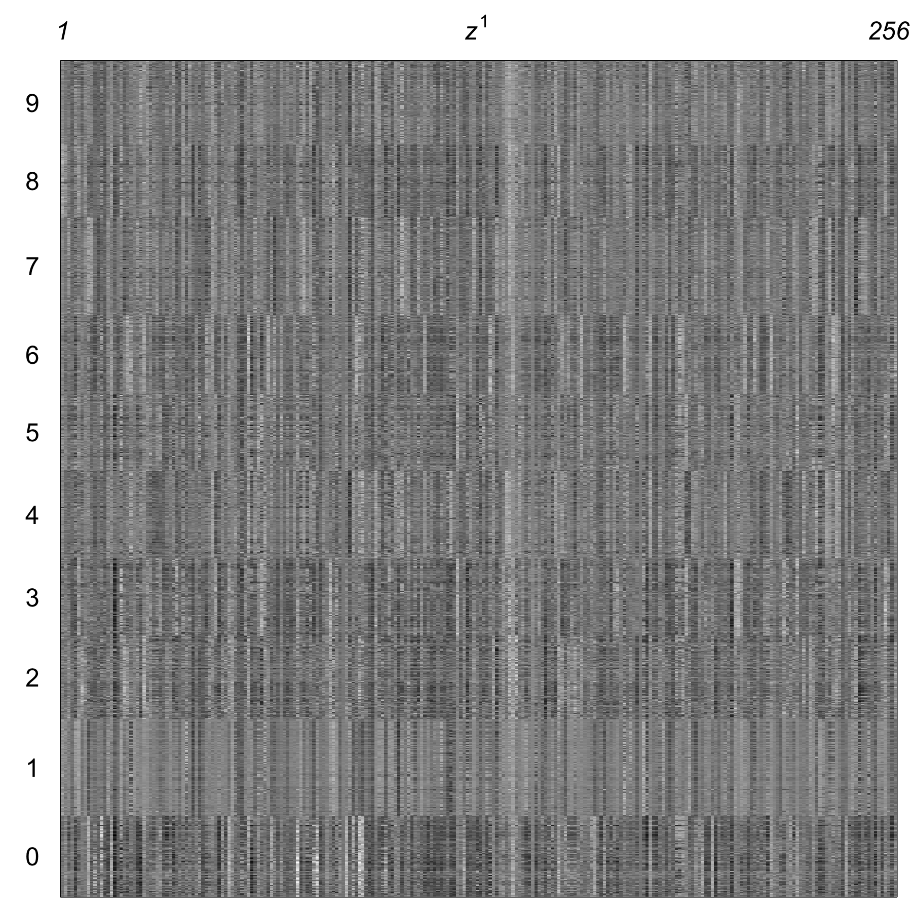<br>
</p>

]


---

.pull-left4[

# Digit embeddings

<ul>
  <li class="m1"><span>Activation patterns cannot be understood on their own, still they can be used to learn much about inputs by treating them as <high>encodings or embeddings of the inputs</high>.</span></li><br>
  <li class="m2"><span>Embeddings are particcularly useful for studying the <high>patterns of relationships</high> between inputs.</span></li>
</ul>


]


.pull-right5[

<br>

<p align = "center">
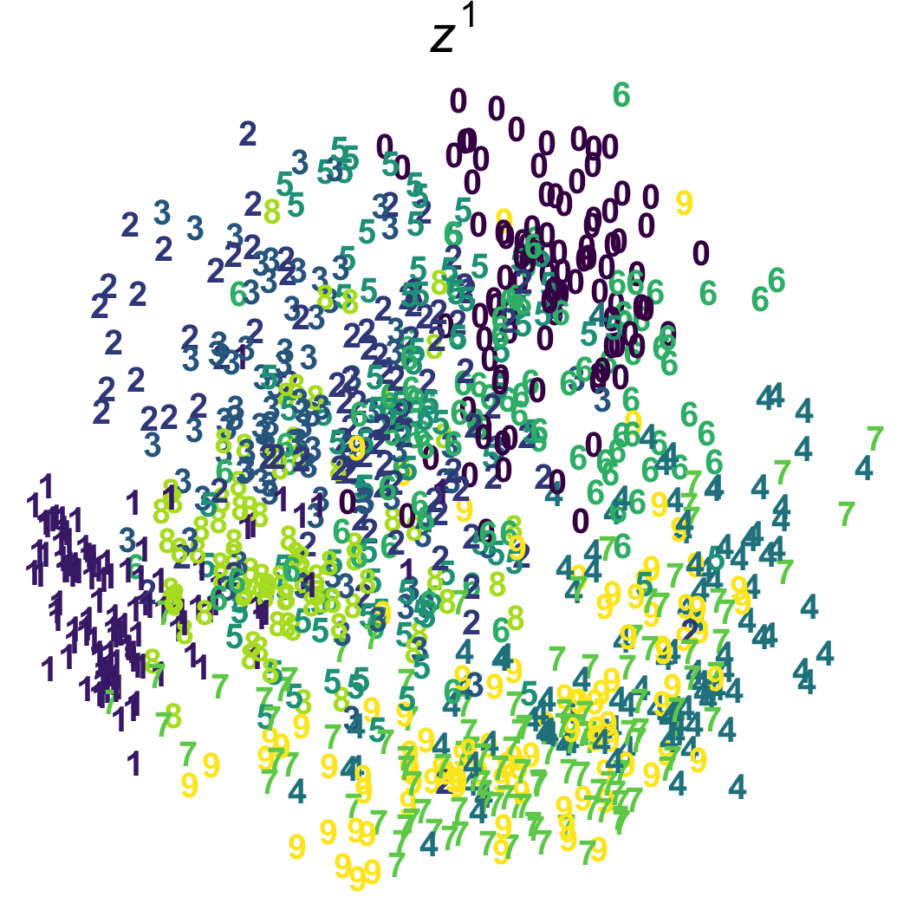<br>
</p>

]

---

.pull-left4[

# Digit embeddings

<ul>
  <li class="m1"><span>Activation patterns cannot be understood on their own, still they can be used to learn much about inputs by treating them as <high>encodings or embeddings of the inputs</high>.</span></li><br>
  <li class="m2"><span>Embeddings are particcularly useful for studying the <high>patterns of relationships</high> between inputs.</span></li>
</ul>


]


.pull-right5[

<br>

<p align = "center">
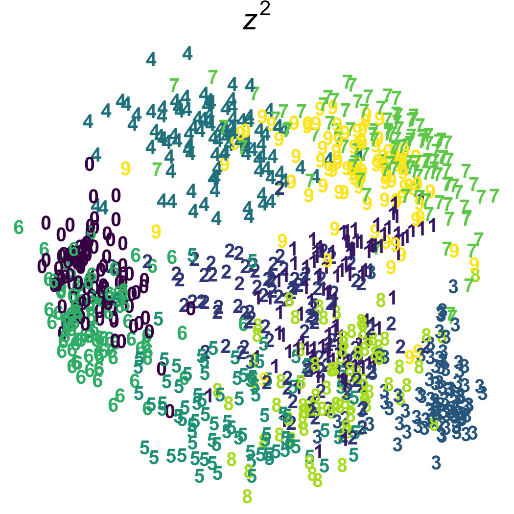<br>
</p>

]


---

.pull-left4[

# Word embeddings

<ul>
  <li class="m1"><span>Embeddings are especially <high>useful and popular for words</high>.</span></li><br>
  <li class="m2"><span>Word embeddings approximate the (distributed) <high>meaning of a word</high>.</span></li>
  <li class="m3"><span>Word embeddings are used for research as much as for <high>many practical applications</high> (e.g., document search).</span></li>
</ul>

]


.pull-right5[

<br><br>

<p align = "center">
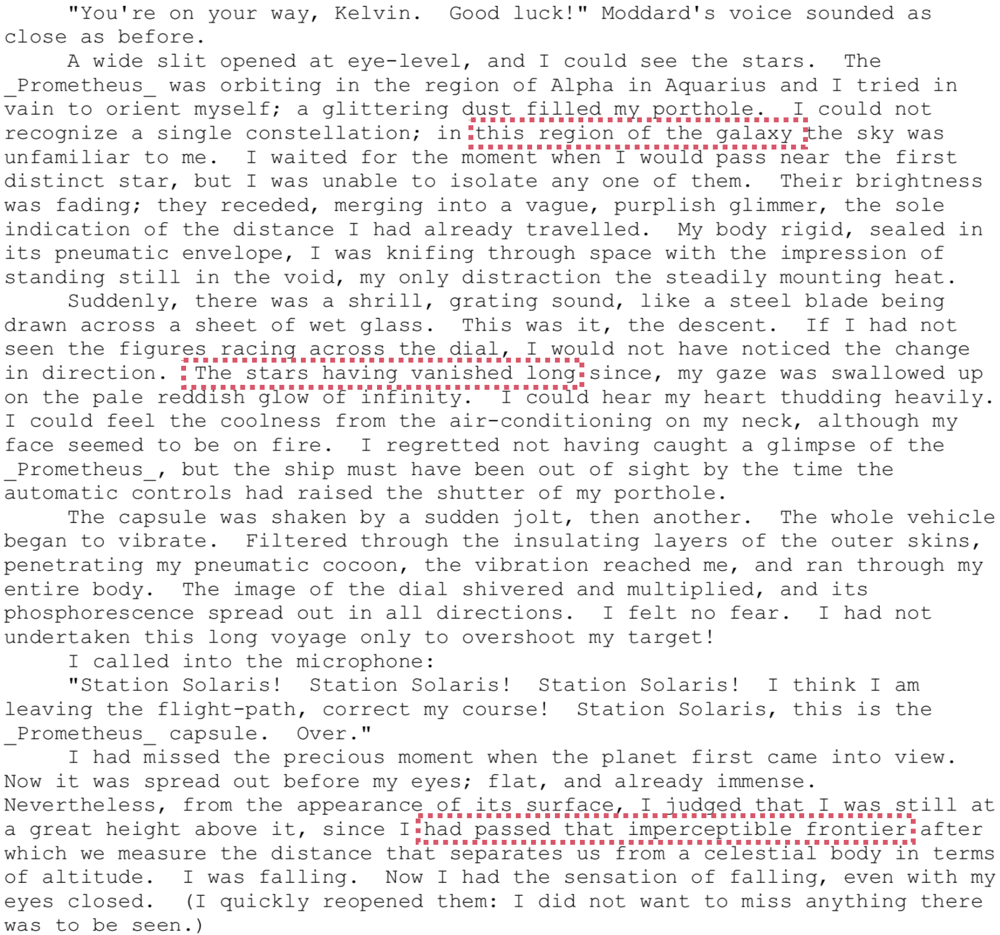<br>
</p>

]

---

# Word embeddings

.pull-left4[

<ul>
  <li class="m1"><span>Embeddings are especially <high>useful and popular for words</high>.</span></li><br>
  <li class="m2"><span>Word embeddings approximate the (distributed) <high>meaning of a word</high>.</span></li>
  <li class="m3"><span>Word embeddings are used for research as much as for <high>many practical applications</high> (e.g., document search).</span></li>
</ul>

]


.pull-right5[

<p align = "center">
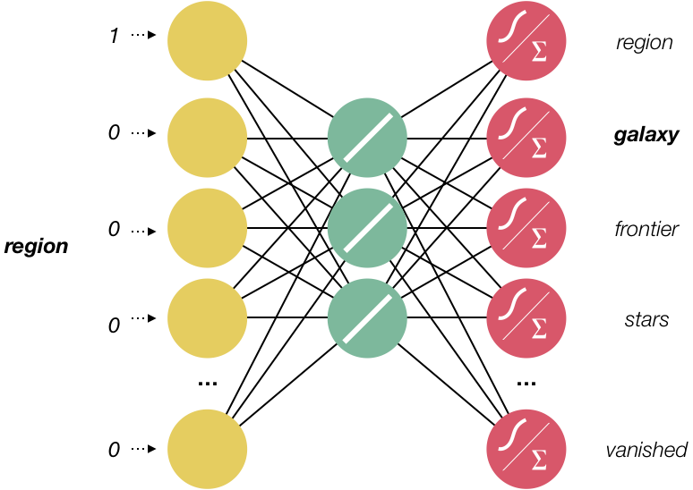<br>
</p>

]

---

# Word embeddings

.pull-left4[

<ul>
  <li class="m1"><span>Embeddings are especially <high>useful and popular for words</high>.</span></li><br>
  <li class="m2"><span>Word embeddings approximate the (distributed) <high>meaning of a word</high>.</span></li>
  <li class="m3"><span>Word embeddings are used for research as much as for <high>many practical applications</high> (e.g., document search).</span></li>
</ul>

]


.pull-right5[

<p align = "center">
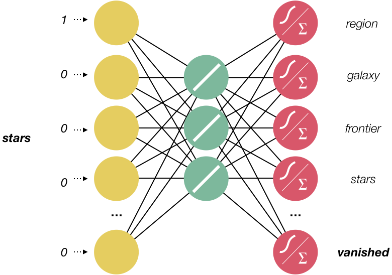<br>
</p>

]


---

# Word embeddings

.pull-left4[

<ul>
  <li class="m1"><span>Embeddings are especially <high>useful and popular for words</high>.</span></li><br>
  <li class="m2"><span>Word embeddings approximate the (distributed) <high>meaning of a word</high>.</span></li>
  <li class="m3"><span>Word embeddings are used for research as much as for <high>many practical applications</high> (e.g., document search).</span></li>
</ul>

]


.pull-right5[

<p align = "center">
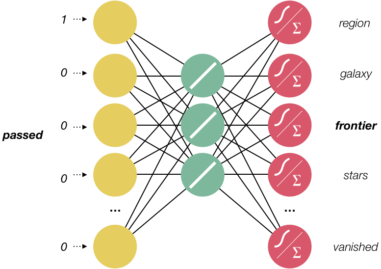<br>
</p>

]


---

.pull-left4[

# Word embeddings

<ul>
  <li class="m1"><span>Embeddings are especially <high>useful and popular for words</high>.</span></li><br>
  <li class="m2"><span>Word embeddings approximate the (distributed) <high>meaning of a word</high>.</span></li>
  <li class="m3"><span>Word embeddings are used for research as much as for <high>many practical applications</high> (e.g., document search).</span></li>
</ul>

]


.pull-right5[

<br><br>

<p align = "center">
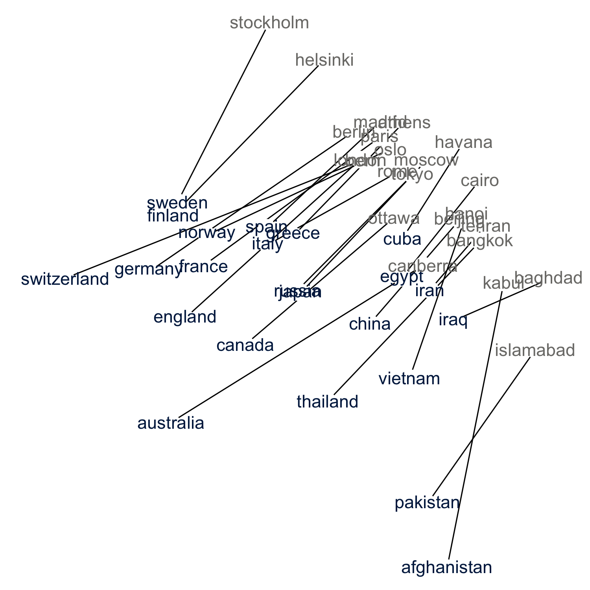<br>
</p>

]


---

# Auto-encoder

.pull-left4[

<ul>
  <li class="m1"><span>Auto-encoders are, in a way, <high>pure embedding learners</high>.</span></li><br>
  <li class="m2"><span>In auto-encoders, <high>the input is the output</high>.</span></li><br>
</ul>

]


.pull-right5[

<p align = "center">
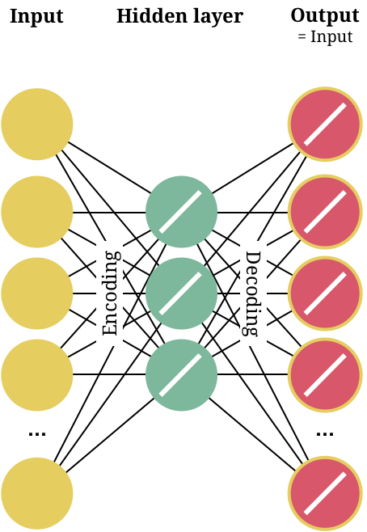<br>
</p>

]

---

# Auto-encoder

.pull-left4[

<ul>
  <li class="m1"><span>Auto-encoders are, in a way, <high>pure embedding learners</high>.</span></li><br>
  <li class="m2"><span>In auto-encoders, <high>the input is the output</high>.</span></li><br>

</ul>

]


.pull-right5[

<p align = "center">
<br>
</p>

]


---

class: middle, center

<h1><a href=https://therbootcamp.github.io/ML_2023ARC/_sessions/Representation/Representation_practical.html>Practical</a></h1>


