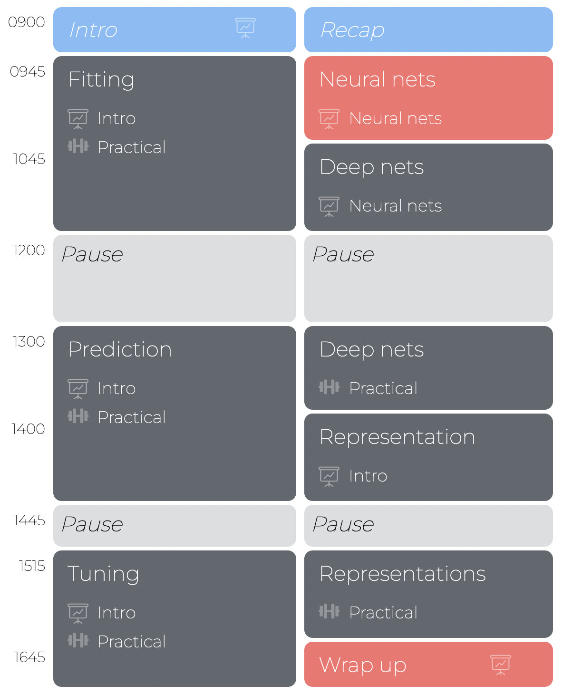

layout: true

<div class="my-footer">
  <span style="text-align:center">
    <span> 
      
    </span>
    <a href="https://therbootcamp.github.io/">
      <span style="padding-left:82px"> 
        <font color="#7E7E7E">
          www.therbootcamp.com
        </font>
      </span>
    </a>
    <a href="https://therbootcamp.github.io/">
      <font color="#7E7E7E">
      Machine Learning with R @ ARC  | September 2023
      </font>
    </a>
    </span>
  </div> 

---

```{r setup, include=FALSE}
options(htmltools.dir.version = FALSE)
# see: https://github.com/yihui/xaringan
# install.packages("xaringan")
# see: 
# https://github.com/yihui/xaringan/wiki
# https://github.com/gnab/remark/wiki/Markdown
options(width=110)
options(digits = 4)
```


.pull-left45[
<br><br><br><br><br>
#  Hello Machine Learners!

You've got the essentials of Machine Learning covered!

]

.pull-right4[


]


---

# Books

A very incomplete series of good books. Books covers are links leading in several cases to free online versions of the book.</high>.

<br><br>
<table width="80%" style="cellspacing:0; cellpadding:0; border:none;">

  <tr>    

  <td>
  <a href="https://www.tmwr.org/"></a>
  </td>

    <td>
  <a href="http://appliedpredictivemodeling.com/"></a>
  </td>
  
        <td>
  <a href="http://www-bcf.usc.edu/~gareth/ISL/ISLR%20First%20Printing.pdf"></a>
  </td>
  
        <td>
  <a href="https://www.manning.com/books/deep-learning-with-r"></a>
  </td>

  
  <td>
  <a href="https://www.deeplearningbook.org/"></a>
  </td>
  
  </tr>


</table>
<br>


<!---

.pull-left4[

# Websites

The web is a great place to learn about R. 

<font size = 4><i>Best begin your journey with:</i></font>

[Google](www.google.com). Just be sure to add *r* to the the search query. 

<br>

<font size = 4><i>Then you will be redirected to one of two pages</i></font>

[R-bloggers](www.r-bloggers.com) is a website on which R users inform each other on the newest developments.

[Stackoverflow](www.r-bloggers.com) is a website on which R users exchange problems and solutions to problems. Try post something yourself. You will be amazed by the turnaround. 


]

.pull-right5[
<p align="left" style="padding: 0 0px"><br><br><br><br><br><br>
    <a href="https://www.google.com/"></a><br><br><br><br2>
    <a href="https://www.r-bloggers.com/"></a><br>
  <a href="https://stackoverflow.com/"></a>
</p>
]


# Upcoming courses


<table class="tg"  style="cellspacing:0; cellpadding:0; border:none; width=100%">
<col width=25%>
<col width=25%>
<col width=25%>
<col width=25%>
<tr valign="top">
  <td>
    <p align="center">
      <a class="project-link" href="https://therbootcamp.github.io/en/#courses" align="center">
      <font style="font-size:20px;weight:700"><br>Explorative Data Analysis with R</font><br>
      <br>
      </img><br><br>
      <high>2 days, February 14/15, 2020</high><br><br><br>
    </p>
  </td>
  <td style="padding-right:5px;padding-left:5px">
    <p align="center">
      <a class="project-link" href="https://therbootcamp.github.io/en/#courses" align="center">
      <font style="font-size:20px;weight:700"><br>Statistics with R<br></font><br>
      <br>
      </img><br><br>
      <high>2 days, March 13/14, 2020</high><br><br><br>
      </a>
    </p>
  </td>
  <td style="padding-right:5px;padding-left:5px">
    <p align="center">
      <a class="project-link" href="https://therbootcamp.github.io/en/#courses" align="center">
      <font style="font-size:20px;weight:700"><br>Machine Learning with R</font><br>
      <br>
      </img><br><br>
      <high>2 days, May 15/16, 2020</high><br><br><br>
      </a>
    </p>
  </td>
  <td style="padding-right:5px;padding-left:5px">
    <p align="center">
      <a class="project-link" href="https://therbootcamp.github.io/en/#courses" align="center">
      <font style="font-size:20px;weight:700"><br>Reporting with R<br></font><br>
      <br>
      </img><br><br>
      <high>2 days, June 5/6, 2020</high><br><br><br>
      </a>
    </p>
  </td>
  </tr>


--->

---

# Other R courses

<br><br>

<table class="tg"  style="cellspacing:0; cellpadding:0; border:none;">
<tr valign="top">
  <col width="20%">
  <col width="20%">
  <col width="20%">
  <col width="20%">
  <col width="20%">
  <td>
    <p align="center">
      <a class="project-link" href="https://therbootcamp.github.io/#courses" align="center">
      </img><br>
      <font style="font-size:20px;weight:700"><br>Intro R<br>(1 day)<br></font>
      
    </p>
  </td>
  <td>
    <p align="center">
      <a class="project-link" href="https://therbootcamp.github.io/#courses" align="center">
      </img><br>
      <font style="font-size:20px;weight:700"><br>Tidyverse<br>(2 day)<br></font>

    </p>
  </td>
  <td>
    <p align="center">
      <a class="project-link" href="https://therbootcamp.github.io/#courses" align="center">
      </img><br>
      <font style="font-size:20px;weight:700"><br>Statistics<br>(2 day)<br></font>

      </a>
    </p>
  </td>
  <td>
    <p align="center">
      <a class="project-link" href="https://therbootcamp.github.io/#courses" align="center">
      </img><br>
      <font style="font-size:20px;weight:700"><br>Markdown<br>(1 day)<br></font>

      </a>
    </p>
  </td>
  <td>
    <p align="center">
      <a class="project-link" href="https://therbootcamp.github.io/#courses" align="center">
            </img><br>
      <font style="font-size:20px;weight:700"><br>Shiny<br>(3 day)<br></font>

      </a>
    </p>
  </td>
  </tr>

---

.pull-left45[
# Please give feedback
<br><br>

<p align = "center">
  </img><br>
  <font style="font-size:10px">from <a href="https://cdn-images-1.medium.com/max/1600/1*5OZNYAfzDZfM1lwJBZEuHQ.png">medium.com</a></font>
</p>

]

.pull-right45[

<p align="center"><br><br><iframe src="https://docs.google.com/forms/d/e/1FAIpQLSf40NItajgQJoEy-mWYWwMBpOv5Za9U3v4yI_AdyqLqeQU5sw/viewform?embedded=true" width="460" height="540">Wird geladen...</iframe></p>

]

---
class: center, middle

<table class="tg"  style="cellspacing:0; cellpadding:0; border:none; width=100%">
<tr>
<td>
</img>
</td>
<td>
<font style="font-size:80px;font-family:'Yanone Kaffeesatz'">Thank you!</font>
</td>
</tr>
</table>

<!-- <a href="http://i.imgur.com/PgtvQar.png"><font size=5>Here is an R Joke.</font></a><br><br> -->
<!-- <font size=5>And now one more thing</font>... -->
